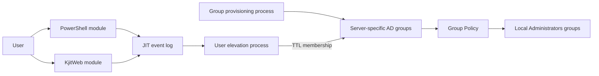
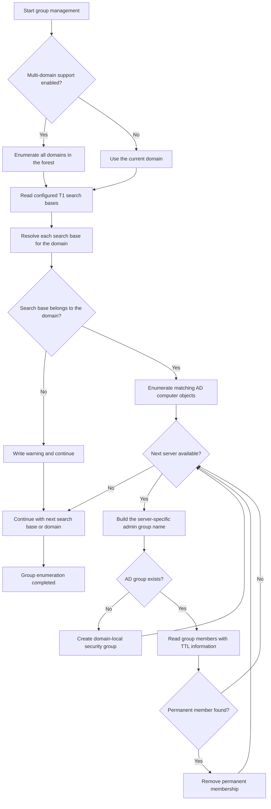

# T1JIT Developer Documentation

This document contains information for developers and contributors. Installation,
configuration, operation, and user-facing command documentation remain in
[`README.md`](README.md).

## Table of Contents

- [Architecture](#architecture)
  - [High-level overview](#high-level-overview)
  - [Solution structure](#solution-structure)
- [Versioning](#versioning)
- [Creating a release](#creating-a-release)
  - [1. Prepare and validate the change](#1-prepare-and-validate-the-change)
  - [2. Create the documented push](#2-create-the-documented-push)
  - [3. Build the installation package](#3-build-the-installation-package)
  - [4. Verify the archive and checksum](#4-verify-the-archive-and-checksum)
  - [5. Create the GitHub release](#5-create-the-github-release)
  - [6. Verify and clean up](#6-verify-and-clean-up)
- [AD group enumeration and provisioning](#ad-group-enumeration-and-provisioning)
- [Contributing](#contributing)

## Architecture

### High-level overview

T1JIT consists of two request interfaces and two background processes. The interfaces
collect elevation requests, while the background processes perform all privileged Active
Directory changes.



- **Group provisioning process** – Runs independently of user requests, discovers the
  configured server objects, and creates the corresponding domain-local administrator
  groups when they do not already exist. It also removes permanent memberships so these
  groups contain only time-bound elevation assignments.
- **User elevation process** – Consumes requests from the JIT event log under the
  configured group Managed Service Account (gMSA). It validates the user, server,
  delegation, requested duration, and concurrency limits before adding the user to the
  server-specific group with an Active Directory TTL. Active Directory removes the
  membership automatically when the TTL expires.
- **PowerShell module** – Provides commands for submitting elevation requests, viewing
  active elevations, reading the JIT configuration, and administering delegations and
  managed search bases. Elevation commands write requests to the same event log used by
  KjitWeb; they do not add users directly to administrator groups.
- **KjitWeb module** – Provides the browser-based request interface. It authenticates the
  user, reads the permitted servers and current TTL memberships from Active Directory,
  validates the submitted server and duration, and writes the request to the JIT event
  log. The web service does not modify group membership directly.

### Solution structure

- `src`: contains all source code
- `release`: contains all files required for installing T1JIT
- `docs`: contains supporting documentation
- `build`: contains scripts for versioning, testing, building, and releasing
- `tests`: contains automated tests

## Versioning

Every change uses the version format `<Major>.<Minor>.<yyyyMMdd>.<counter>`, for example
`0.1.20260823.1`. The counter starts at `1` each day and increases for every additional
version created on that day. All files in one change share the same version.
Each entry in `file-versions.json` records that shared version and the file's SHA-256
hash. `Update-Version.ps1` also writes the version to the main `README.md` heading.
On `main`, the heading contains only the version; on every other branch, it also contains
the branch name.

Every commit must add its user- or administrator-facing change below `## [Unreleased]`
in `CHANGELOG.md` and stage that file. The versioning script moves those pending entries
into a dated section for the exact version generated by the commit. A missing or empty
staged changelog update stops the commit.

Enable automatic versioning for local commits once after cloning the repository:

```powershell
git config core.hooksPath .githooks
```

The pre-commit hook runs `Update-Version.ps1 -Staged`, creates the next version for
the files staged in that commit, rebuilds the distributable `release` directory, and
stages `VERSION`, `file-versions.json`, the versioned `CHANGELOG.md`, the updated
`README.md`, and the generated release files.

Use the repository push script for GitHub pushes:

```powershell
./build/Push-GitHub.ps1
```

It records every outgoing commit and changed file in `History.md`, creates a versioned
history commit, and then pushes the current branch. The pre-push hook rejects direct
GitHub pushes when outgoing commits have not been documented.

Before committing changes, update `VERSION` and `file-versions.json` manually only when
you need to inspect the resulting metadata before the pre-commit hook runs:

```powershell
./build/Update-Version.ps1
```

For a branch that already contains commits, include every change since the target branch:

```powershell
./build/Update-Version.ps1 -BaseRef origin/main
```

Use `-Major` or `-Minor` only when intentionally changing those version components. The
release build and the GitHub workflow reject invalid versions or changed files missing from
`file-versions.json`. Generated .NET output below `bin` and `obj` is excluded.

Project licensing and the centralized warranty disclaimer are documented in `LICENSE` and
`README.md`. Source files do not duplicate the project disclaimer.

## Creating a release

A release consists of a versioned Git commit, a generated installation package, a ZIP
archive, a SHA-256 checksum, and a GitHub release. Development releases use the suffix
`-test` and are marked as GitHub pre-releases. Production releases have no suffix and
must be created from the approved production branch.

The release must be built only after the documented push. `Push-GitHub.ps1` creates a
final history commit, and the pre-commit hook assigns that commit a new repository version.
Reading `VERSION` or building binaries before this step can therefore produce an artifact
whose embedded version does not match the GitHub tag.

### 1. Prepare and validate the change

Start from the branch that should be released and confirm the intended changes:

```powershell
git status --short
git branch --show-current
git diff --check
```

Run the tests and builds required by the changed components. At minimum, build KjitWeb
when its source changed and parse modified Windows PowerShell scripts with Windows
PowerShell 5.1.

Enable the repository hooks once per clone:

```powershell
git config core.hooksPath .githooks
```

Stage only the intended files and create the functional commit:

```powershell
git add -- <files>
git commit -m "Describe the release change"
```

The pre-commit hook runs `Update-Version.ps1 -Staged` and adds the updated `VERSION`,
`file-versions.json`, and generated release files to the commit. Do not bypass the hook
for a release commit.

### 2. Create the documented push

The working tree must be clean before running the repository push script:

```powershell
git status --short
./build/Push-GitHub.ps1
```

The script fetches the remote branch, records outgoing commits and changed files in
`History.md`, creates the versioned history commit, and pushes the branch. Direct GitHub
pushes are rejected by the pre-push hook when the outgoing commits are not documented.

After the push, capture the final version and immutable commit:

```powershell
$version = (Get-Content ./VERSION -Raw).Trim()
$commit = (git rev-parse HEAD).Trim()
$branch = (git branch --show-current).Trim()

git status --short
git rev-parse HEAD
git rev-parse "origin/$branch"
```

The working tree must still be clean, and the local and remote commit IDs must match.

### 3. Build the installation package

Use a temporary detached Git worktree so generated `release`, `publish-service`, and
`Installationspackage` content does not modify the development worktree:

```powershell
$releaseWorktree = Join-Path $env:TEMP "T1JIT-release-$version"
$artifactDirectory = Join-Path $env:TEMP "T1JIT-artifacts-$version"

Remove-Item $releaseWorktree -Recurse -Force -ErrorAction SilentlyContinue
Remove-Item $artifactDirectory -Recurse -Force -ErrorAction SilentlyContinue
New-Item $artifactDirectory -ItemType Directory -Force | Out-Null

git worktree add --detach $releaseWorktree $commit
Push-Location $releaseWorktree
try {
    # Use -Prerelease for a development release; omit it for production.
    ./build/New-InstallationPackage.ps1 `
        -BuildRelease `
        -ArchivePath (Join-Path $artifactDirectory "T1JIT-$version-test.zip") `
        -Version $version `
        -Prerelease
}
finally {
    Pop-Location
}
```

`New-InstallationPackage.ps1 -BuildRelease` performs the release build and then runs
the mandatory Pester 5 tests against the PowerShell modules that will be packaged. The
tests validate the manifest and module syntax and exercise `Get-JITConfig` in Windows
PowerShell 5.1. A missing Pester 5 installation or any failed test aborts package creation.
Install Pester when necessary with:

```powershell
Install-Module Pester -MinimumVersion 5.0.0 -Scope CurrentUser
```

After successful tests, the script stages the complete distributable content in a
temporary folder, verifies that required files such as `install-JIT.ps1`, `KjitCore.dll`,
and `KjitWeb.dll` exist, and always compresses the staged content into a single ZIP archive
together with a `.sha256` checksum file. The staged, uncompressed copy is deleted
afterwards. When `-ArchivePath` is omitted, the archive and checksum are written to
`Installationspackage` and named `T1JIT-<Version>-<Branch>[-test].zip`, using the current
Git branch unless `-Branch` is specified. Never reuse an existing version or overwrite
assets belonging to an existing tag.

Confirm that the package version matches the release version by reading the `VERSION`
entry from inside the archive:

```powershell
$archivePath = Join-Path $artifactDirectory "T1JIT-$version-test.zip"
$checksumPath = "$archivePath.sha256"

Add-Type -AssemblyName System.IO.Compression.FileSystem
$zip = [System.IO.Compression.ZipFile]::OpenRead($archivePath)
try {
    $packageVersion = (
        New-Object IO.StreamReader($zip.GetEntry("VERSION").Open())
    ).ReadToEnd().Trim()
}
finally {
    $zip.Dispose()
}

if ($packageVersion -ne $version) {
    throw "Package version '$packageVersion' does not match release version '$version'."
}
```

For a production release, use
`-ArchivePath (Join-Path $artifactDirectory "T1JIT-$version.zip")` and omit
`-Prerelease`.

### 4. Verify the archive and checksum

Verify the archive before uploading it:

```powershell
Get-Item $archivePath, $checksumPath
Get-FileHash $archivePath -Algorithm SHA256
tar.exe -tf $archivePath | Select-Object -First 20
```

The archive must contain `VERSION`, `file-versions.json`, `install-JIT.ps1`, the
PowerShell modules, and the KjitWeb installation files.

### 5. Create the GitHub release

Before creating the release, verify that [`CHANGELOG.md`](CHANGELOG.md) contains the
versioned section generated by the pre-commit hook. Extract that entry to use as the
release notes instead of auto-generated commit lists:

```powershell
$releaseNotesPath = Join-Path $artifactDirectory "release-notes-$version.md"
$changelog = Get-Content CHANGELOG.md -Raw
if ($changelog -notmatch "(?ms)^## \[$([regex]::Escape($version))\].*?(?=^## \[|\z)") {
    throw "CHANGELOG.md has no entry for version '$version'. Add one before releasing."
}
$Matches[0].TrimEnd() |
    Set-Content -LiteralPath $releaseNotesPath -Encoding utf8
```

Install and authenticate GitHub CLI before creating a release:

```powershell
gh auth status
```

Create a development pre-release from a development branch such as `dev`:

```powershell
$tag = "v$version-test"

gh release create $tag $archivePath $checksumPath `
    --target $commit `
    --title "T1JIT $version Test" `
    --notes-file $releaseNotesPath `
    --prerelease
```

For an approved production release, use a production tag and omit `--prerelease`:

```powershell
$tag = "v$version"

gh release create $tag $archivePath $checksumPath `
    --target $commit `
    --title "T1JIT $version" `
    --notes-file $releaseNotesPath
```

Create production releases only from the approved production commit. The value passed
to `--target` is the captured commit ID rather than a moving branch name, ensuring that
the tag identifies exactly the code used for the package.

### 6. Verify and clean up

Verify the published tag, release type, and assets:

```powershell
gh release view $tag --json tagName,isPrerelease,targetCommitish,name,assets
git ls-remote --tags origin $tag
```

Download the assets into a separate directory and verify the checksum independently when
preparing a production release. Retain the checksum with the release assets.

After successful verification, remove the temporary build worktree and artifacts as
required:

```powershell
git worktree remove $releaseWorktree --force
Remove-Item $artifactDirectory -Recurse -Force
git worktree prune
```

Do not remove the temporary worktree until the GitHub assets have been uploaded and
verified. If a build or upload fails, correct the cause and create a new repository
version instead of replacing an already published production release.

## AD group enumeration and provisioning

The group-management process discovers configured server objects and ensures that every
server has the required domain-local administrator group. Existing permanent memberships
are removed so elevation remains time-bound.



## Contributing

- [Kili69](https://github.com/Kili69)
- [Bulgwei](https://github.com/Bulgwei)
