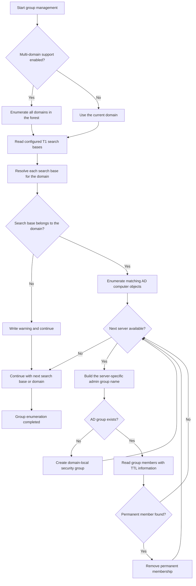
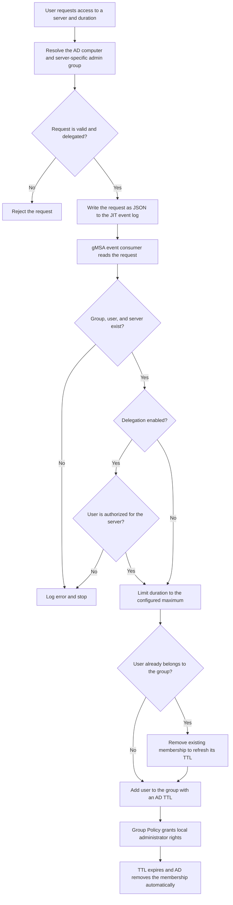

# Just-In-Time Solution for Active Directory Member Servers

## Table of Contents

- [Project Description](#project-description)
- [Problem Statement](#problem-statement)
- [How does T1JIT works](#how-does-t1jit-works)
    - [AD group enumeration and provisioning](#ad-group-enumeration-and-provisioning)
    - [Temporary privilege assignment](#temporary-privilege-assignment)
- [Using T1JIT with PowerShell](#using-t1jit-with-powershell)
- [Quick-start Installation](#quick-start-installation)
    - [Install Just-In-Time](#install-just-in-time)
    - [Configure Just-In-Time](#configure-just-in-time)
    - [Configure elevation privileges](#configure-elevation-privileges)
    - [Useage of JIT](#useage-of-jit)
- [Using the Web Interface](#using-the-web-interface)
    - [Installation of the KJIT-Web service](#installation-of-the-kjit-web-service)
        - [Publish KjitWeb as a Microsoft Entra Enterprise Application](#publish-kjitweb-as-a-microsoft-entra-enterprise-application)
    - [Using the KJIT-Web service](#using-the-kjit-web-service)
    - [Configuration of the KJIT-Web service](#configuration-of-the-kjit-web-service)
- [Setup addtional JIT servers](#setup-addtional-jit-servers)
- [Security Considerations](#security-considerations)
- [Configuration and Customization](#configuration-and-customization)
    - [Get-JITConfig](#get-jitconfig)
    - [Get-AdminStatus](#get-adminstatus)
    - [Get-UserElevationStatus](#get-userelevationstatus)
    - [Get-JITDelegation](#get-jitdelegation)
    - [Get-JITServerOU](#get-jitserverou)
    - [Remove-JITDelegation](#remove-jitdelegation)
    - [Remove-JITServerOU](#remove-jitserverou)
    - [Add-jitdelegation](#add-jitdelegation)
    - [Add-JITServerOU](#add-jitserverou)
- [Restrict KjitWeb access to trusted workstations with IPsec](#restrict-kjitweb-access-to-trusted-workstations-with-ipsec)
- [Developer information](#developer-information)
    - [Solution Structure](#solution-structure)
    - [Versioning](#versioning)
- [Contributing](#contributing)
- [License](#-license)
- [Updates](#updates)

## Project Description

This project provides a Just-In-Time (JIT) solution for managing local administrator rights on Active Directory member servers. The goal is to reduce the risk of lateral movement in case of server compromise by ensuring that users are only temporarily granted elevated privileges.
This project is based on Active Directory features and do not required agents oder high privileged users on the target systems.

## Problem Statement

In many IT environments, users are members of the local administrators group on multiple servers. If one server is compromised, an attacker can exploit these privileges to move laterally across the network. Many existing solution requires Agents, high privileged or using privileged accounts in the background.
All ot those solutions provides a lateral movement attack path, because there is one high privileged identitiy on the target system.
This soultion works without a privileged identitiy on the target computers.

## How does T1JIT works

T1JiT works with Active Directory groups and group polices. A user can connect to the KJIT-Web Service and select a target server and the elevation time. With the "request access" access button a request message is written to the Just-In-Time event log.
The event log is consumed from a group managed service account, who reads the event log and validate the user is allowed to request the access. If the user is allowed, the user object if time-bound added to the group who is member of the local administrator on the target server.
While the group where the user is added contains the target server in the name,only one group policy with a variable is required to assign the local administrator rights on the target server.
The user is automatically removed from the local administrator group after the time is expired.
The groups will be automatically created by the JIT-Solution, if a computer oject exists in the configured target OU.

### AD group enumeration and provisioning



### Temporary privilege assignment



## Using T1JIT with PowerShell

Administrators can request temporary local administrator privileges directly from PowerShell. The T1JIT PowerShell module must be installed on the computer, and the user or one of their groups must have a JIT delegation for the organizational unit that contains the target server. No permission to modify Active Directory groups is required.

Import the module and request access to a server for a specific number of minutes:

```powershell
Import-Module Just-In-time
New-AdminRequest -Server "server01.contoso.com" -Minutes 30
```

If `-Minutes` is omitted, the configured default elevation time is used. Values outside the configured limits are adjusted to the allowed minimum or maximum. To display the current user's active elevations and their remaining time, run:

```powershell
Get-AdminStatus
```

After the request has been processed, start a new sign-in session on the target server so that the temporary group membership is included in the user's access token. The Active Directory TTL automatically removes the membership when the approved time expires.

## Quick-start Installation

Download all files from the relase directory and run the install-JIT.ps1. If the PIM feature in Active Directory is not enabled, Enterprise-Administrator privileges are required.
If you installing this JIT-Solution not as a Domain Administrator the following pre-requisites are required:
- Validate Active Directory root-key from group managed service account exists
- Folder \\<domain>\\SYSVOL\<domain>\JUST-IN-TIME
- OU for the Just-In-Time groups e.g. OU=JIT-Administrator Groups,OU=Tier 1,OU=Admin,DC=<domain>
- Group Managed Service Account
    - Allow to retrieve password on the JIT server
    - Create group object in the JIT-Administrator Groups OU

required installation permission:
- Member of the local administrator groups
- Create file permission on \\<domain>\\SYSVOL\<domain>\JUST-IN-TIME

### Install Just-In-Time

1. Run the install-JIT.ps1 script. This script will install the JIT-Solution on the current computer.
2. Move to the %ProgramFiles%\Just-IN-time folder and the config-Jit.ps1 script to configure the JIT-Solution. This script will ask for the required configuration parameters and write them to the config file.
3. COnfigure the group policy to assign the local administrator rights on the target servers. The group policy should contain a preference to add the <AdminPrefix>%AD-DNSdomainname%<DomainSeparator>%<ComputerName>% to the local administrator group.
4. (optional) Install the KJIT-Web service with the install-kjitweb.ps1 script. This script will install the KJIT-Web service on the current computer.

### Configure Just-In-Time

The configuration of the JIT-Solution is done with the config-JIT.ps1 script. This script will ask for the required configuration parameters and write them to the config file. The configuration parameters are:
- Admin Prefix: The prefix for the group name who is member of the local administrator group on the target server. The group name will be in the format <AdminPrefix>%AD-DNSdomainname%<DomainSeparator>%<ComputerName>%. The default value is "Admin_".
- GMSAccount: The name of the group managed service account who will read the event log and add the users to the local administrator group on the target server. The format should be <domain>\<gmsaccountname>$.
- OU for local Administrator groups: The OU where the groups who are member of the local administrator group on the target server are located. Take care onyl the GMSA and domain administrators should have permissions to create groups in this OU. The groups will be automatically created by the JIT-Solution, if a computer oject exists in the configured target OU.
- Maximum elevation time: The maximum time for the elevation. The user will be automatically removed from the local administrator group after the time is expired. The default value is 60 minutes.
- searchbase: The searchbase for the computer objects of the target servers. The JIT-Solution will only work for computer objects who are located in this OU or its child OUs.

### Configure elevation privileges

To allow a user to request administrators privileges on servers in a OU use the ADD-JITdelegation command. This command will add user or group to be evlevated on the target servers. The command should be run with the following parameters:
- Identity: The identity of the user or group who should be allowed to request administrators privileges on the target servers. The format should be <domain>\<username> or <domain>\<groupname>.
- OU: The OU where the computer objects of the target servers are located. The JIT
Solution will only work for computer objects who are located in this OU or its child OUs. A user will inherit the privileges to request administrators privileges on the target servers, if the user is member of a group who is allowed to request administrators privileges on the target servers.
create sub OU's below the target OU and delegate users / groups to this sub OU's to have a better structure and overview of the delegations.
e.g.
add-jitdelegation -Identity "domain\serveradmins" -OU "OU=Server,DC=domain,DC=local"
    Any user who is member of the "domain\serveradmins" group will be able to request administrators privileges on the target servers who are located in the "OU=Server,DC=domain,DC=local" OU or its child OUs.
add-jitdelegation -Identity "domain\SQLAdmins" -OU "OU=SQLServer,OU=Server,DC=domain,DC=local"
    Any user who is member of the "domain\SQLAdmins" group will be able to request administrators privileges on the target servers who are located in the "OU=SQLServer,OU=Server,DC=domain,DC=local" OU or its child OUs.
    Addtional members of the "domain\serveradmins" group will also be able to request administrators privileges on the target servers who are located in the "OU=SQLServer,OU=Server,DC=domain,DC=local" OU or its child OUs, because the "domain\serveradmins" group is member of the "domain\SQLAdmins" group.

### Useage of JIT

A user can now request administrator privielges via Powershell withou any privilege in active directory. To request administrator privileges for a target server the user can use the New-AdminRequest command. This command should be run with the following parameters:
- Server: The name of the target server. The format should be <computername>
- Duration: The duration for the elevation. The default value is 60 minutes. The maximum value is the value configured in the configuration of the JIT-Solution.
e.g.
    New-AdminRequest -Server myserver.domain.local
        This will request administrator privileges for the "myserver" server for 60 minutes. The user will be automatically removed from the local administrator group after 60 minutes.
    New-AdminRequest -Server myserver.domain.local -Duration 30
        This will request administrator privileges for the "myserver" server for 30 minutes. The user will be automatically removed from the local administrator group after 30 minutes.
    New-AdminRequest -Server myserver.domain.local -Duration 120 -User anotheruser
        This will request administrator privileges for the "myserver" server for 120 minutes on behalf of the user "anotheruser@

## Using the Web Interface

> [!IMPORTANT]
> KjitWeb can request privileged access and must only be reachable from trusted, managed computers or through a trusted access proxy. Do not expose the KjitWeb service or port `5240` directly to the Internet. Restrict the Windows Firewall rule and all network security controls to the required management clients or proxy connectors, and use HTTPS for every connection that can carry credentials.
>
> In Microsoft Azure environments, publish KjitWeb through Microsoft Entra Application Proxy as an Enterprise Application. Require Microsoft Entra pre-authentication and apply Conditional Access policies such as MFA and a compliant or managed device. Block direct client access to the internal KjitWeb URL; otherwise, users could bypass Conditional Access and MFA.

The KJIT-Web service provides a web interface for users to request administrator privileges on the target servers. The web interface is accessible via http://<server>.<domain>:5240. The user can select the target server and the duration for the elevation. The user can also see the status of their requests and the remaining time for the elevation.

### Installation of the KJIT-Web service

The KJIT-Web service can be installed with the install-kjitweb.ps1 script. This script will install the KJIT-Web service on the current computer. The KJIT-Web Service must be installed on a server where the JIT-Solution is installed.

#### Publish KjitWeb as a Microsoft Entra Enterprise Application

For Azure-connected environments, use Microsoft Entra Application Proxy to publish the internally hosted KjitWeb service:

1. Install a Microsoft Entra private network connector on a domain-joined Windows server that can reach the internal KjitWeb URL. For production, use a dedicated connector group with at least two connectors.
2. In the Microsoft Entra admin center, open **Enterprise applications**, create a new **on-premises application**, and enter the internal KjitWeb URL, for example `http://kjitweb.contoso.com:5240`.
3. Select **Microsoft Entra ID** as the pre-authentication method, choose the dedicated connector group, and enable **User assignment required**. Assign only the administrator groups that are allowed to use KjitWeb.
4. For seamless sign-on, configure **Integrated Windows Authentication**. Register the internal `HTTP/kjitweb.contoso.com` SPN for the identity that runs KjitWeb and configure Kerberos constrained delegation from the connector computer accounts only to this SPN. Verify the SPN and delegation configuration before enabling access.
5. Create a Conditional Access policy that targets the KjitWeb Enterprise Application and requires MFA. Restrict access further to compliant or Microsoft Entra hybrid joined management devices and approved locations as required by the organization.
6. Restrict inbound access to the KjitWeb port to the private network connector servers, test sign-in and JIT requests through the external Application Proxy URL, and confirm that the internal URL is not reachable from user networks.

Use HTTPS for the internal connector-to-KjitWeb connection whenever possible. Microsoft Entra Application Proxy protects the external endpoint, but it does not remove the need to secure the internal network path. Microsoft Entra Application Proxy and Conditional Access require suitable Microsoft Entra licensing.

### Using the KJIT-Web service

To use the KJIT-Web service, the user can open a web browser and navigate to http://<server>.<domain>:5240. The user can then select the target server and the duration for the elevation. The user can also see the status of their requests and the remaining time for the elevation.

### Configuration of the KJIT-Web service

The KJIT-Web service can be configured with the appsettings.json file. The configuration parameters are:
- Branding: The branding configuration for the web interface. The parameters are:
    - LogoPath: The path to the logo for the web interface. The default value is "/images/logo.png". The logo should be a square image with a size of 100x100 pixels.
    - CompanyName: The name of the company for the web interface. The default value is "Contoso Ltd.". The company name will be displayed in the header of the web interface.
- AllowedHosts: The allowed hosts for the web interface. The default value is "*". The web interface will only be accessible from the specified hosts. To allow access from any host, set the value to "*".

## Setup addtional JIT servers

TO add a addtional JIT server to the environment, the JIT-Solution must be installed on the additional server. The additional server must be joined to the same domain as the first server.
to install the program files run the install-jit.ps1 script on the additional server. then run the config-jit.ps1 script to configure the JIT-Solution on the additional server. Use the -quiet parameter and the -configurationfile parameter to use the same configuration as the first server. e.g.
    config-jit.ps1 -quiet -configurationfile \\<domain>\SYSVOL\<domain>\JUST-IN-TIME\config.json

## Security Considerations
- The KJIT-Web service should be configured to use HTTPS to encrypt the communication between the client and the server.
- The KJIT-Web service should be offered via Azure Enterprise Application Proxy or a similar solution to provide secure remote access to the web interface.

## Configuration and Customization
The JIT-Solution can be customized to fit the specific needs of the organization. The configuration parameters can be adjusted to meet the security requirements and the operational needs of the organization. To customize the JIT solution use the Powershell module who is installed with the JIT-Solution. The module provides commands to manage the configuration and the delegations for the JIT-Solution.

### Get-JITConfig
The Get-JITConfig command can be used to retrieve the current configuration of the JIT-Solution. This command will return an object with the current configuration parameters.

#### Parameters
- configurationfile: The path to the configuration file. If this parameter is not specified, the command will return the configuration from the default configuration file located in the installation directory of the JIT-Solution.
#### Example

    Get-JITConfig
        This will return the current configuration of the JIT-Solution. The output will be an object with the current configuration parameters.
    Get-JITconfig -configurationfile C:\config\jitconfig.json
        This will return the configuration of the JIT-Solution from the specified configuration file. The output will be an object with the configuration parameters from the specified configuration file.
### Get-AdminStatus
The Get-AdminStatus command can be used to retrieve the current status of the administrator privileges for a target server. This command will return an object with the current status of the administrator privileges for the specified target server.

#### Parameters
- User: The user for whom the status should be retrieved. The format should be <domain>\<username>. If this parameter is not specified, the command will return the status for the current user.

#### Example

    Get-AdminStatus
        This will return the current elevation status for the current user.
    Get-AdminStatus -User anotheruser
        This will return the current elevation status for the user "anotheruser".

### Get-UserElevationStatus
The Get-UserElevationStatus command can be used to retrieve the current elevation status for a server. This command will return an object with the current elevation status for the specified server.

#### Parameters
- Server: The name of the target server. The format should be <computername>.

#### Example

    Get-UserElevationStatus -Server myserver
        This will return the current elevation status for the "myserver" server. The output will be an object with the current elevation status for the "myserver" server.

### Get-JITDelegation
The Get-JITDelegation command can be used to retrieve the current delegations for the JIT-Solution. This command will return an object with the current delegations for the JIT-Solution.

#### Example

    Get-JITDelegation
        This will return the current delegations for the JIT-Solution. The output will be an object with the current delegations for the JIT-Solution.

### Get-JITServerOU
The Get-JITServerOU command can be used to retrieve the current server OU for the JIT-Solution. This command will return the current server OU for the JIT-Solution.

#### Example

    Get-JITServerOU
        This will return the current server OU for the JIT-Solution. The output will be the current server OU for the JIT-Solution.

### Remove-JITDelegation
The Remove-JITDelegation command can be used to remove a delegation for the JIT-Solution. This command will remove the specified delegation for the JIT-Solution.

#### Parameters
- Identity: The identity of the user or group whose delegation should be removed. The format should be <domain>\<username> or <domain>\<groupname>.
- OU: The OU where the computer objects of the target servers are located. The JITSolution will only work for computer objects who are located in this OU or its child OUs. A user will inherit the privileges to request administrators privileges on the target servers, if the user is member of a group who is allowed to request administrators privileges on the target servers.

#### Example

    Remove-JITDelegation -Identity "domain\serveradmins" -OU "OU=Server,DC=domain,DC=local"
        This will remove the delegation for the "domain\serveradmins" group for the target servers who are located in the "OU=Server,DC=domain,DC=local" OU or its child OUs. Any user who is member of the "domain\serveradmins" group will no longer be able to request administrators privileges on the target servers who are located in the "OU=Server,DC=domain,DC=local" OU or its child OUs.
### Remove-JITServerOU
The Remove-JITServerOU command can be used to remove the server OU for the JIT-Solution. This command will remove the server OU for the JIT-Solution.

#### Parameters
- OU: The OU where the computer objects of the target servers are located. The JIT-Solution will only work for computer objects who are located in this OU or its child OUs. A user will inherit the privileges to request administrators privileges on the target servers, if the user is member of a group who is allowed to request administrators privileges on the target servers.
#### Example

    Remove-JITServerOU
        This will remove the server OU for the JIT-Solution. The JIT-Solution will no longer work for any target servers, because the server OU is required for the JIT-Solution to function.
### Add-jitdelegation
The Add-JITDelegation command can be used to add a delegation for the JIT-Solution. This command will add the specified delegation for the JIT-Solution.

#### Parameters
- Identity: The identity of the user or group who should be allowed to request administrators privileges on the target servers. The format should be <domain>\<username> or <domain>\<groupname>.
- OU: The OU where the computer objects of the target servers are located. The JIT  Solution will only work for computer objects who are located in this OU or its child OUs. A user will inherit the privileges to request administrators privileges on the target servers, if the user is member of a group who is allowed to request administrators privileges on the target servers.

#### Example

    Add-JITDelegation -Identity "domain\serveradmins" -OU "OU=Server,DC=domain,DC=local"
        This will add a delegation for the "domain\serveradmins" group for the target servers who are located in the "OU=Server,DC=domain,DC=local" OU or its child OUs. Any user who is member of the "domain\serveradmins" group will be able to request administrators privileges on the target servers who are located in the "OU=Server,DC=domain,DC=local" OU or its child OUs.

### Add-JITServerOU
The Add-JITServerOU command can be used to add a server OU for the JIT-Solution. This command will add the specified server OU for the JIT-Solution.

#### Parameters
- OU: The OU where the computer objects of the target servers are located. The JIT-Solution will only work for computer objects who are located in this OU or its child OUs. A user will inherit the privileges to request administrators privileges on the target servers, if the user is member of a group who is allowed to request administrators privileges on the target servers.

#### Example

    Add-JITServerOU -OU "OU=Server,DC=domain,DC=local"
        This will add the "OU=Server,DC=domain,DC=local" OU for the JIT-Solution. Any computer objects located in this OU or its child OUs will be considered as target servers for the JIT-Solution.

## Restrict KjitWeb access to trusted workstations with IPsec

KjitWeb is a privileged access application and should only be reachable from trusted, managed workstations. In an Active Directory domain, Windows Defender Firewall with IPsec can enforce this restriction without changing the KjitWeb application. IPsec authenticates the client computer with its Kerberos computer account before Windows permits a connection to the KjitWeb TCP port. KjitWeb then performs its existing user authentication separately.

The resulting access requirements are:

1. The client computer is a member of an approved Active Directory computer group and successfully authenticates to the KjitWeb server with Kerberos.
2. The user successfully authenticates to KjitWeb and is authorized to request access to the selected server.

IPsec controls the source computer, not the user. Do not add user accounts to the trusted-workstation group.

### Prerequisites

- The KjitWeb server and trusted workstations are joined to the Active Directory domain or to domains with a working trust relationship.
- The clients can reach a domain controller and obtain Kerberos tickets.
- DNS resolution, domain time synchronization, and the required domain firewall paths are working.
- The KjitWeb service uses a fixed TCP port. The default port is `5240`.
- Group Policy Management and Windows Defender Firewall with Advanced Security are available.
- A recovery method such as console access to the KjitWeb server is available during rollout.

IPsec authenticates and can protect the network connection, but HTTPS is still recommended for KjitWeb. In particular, Kerberos authentication by itself does not turn HTTP into a generally encrypted application channel, and Basic Authentication must never be transported over unencrypted HTTP.

### 1. Create the trusted-workstation group

Create a dedicated global security group, for example:

```text
KjitWeb-Trusted-Workstations
```

Add the **computer accounts** of the approved administrative workstations to this group, for example `ADMIN-WS01$` and `ADMIN-WS02$`. After changing computer-group membership, restart the affected workstation or purge and renew its computer Kerberos tickets before testing. A restart is the least ambiguous method during initial deployment.

Manage this group as a privileged access control. Use a controlled process for additions and removals, review membership regularly, and do not nest broad groups such as `Domain Computers`.

### 2. Create a pilot Group Policy deployment

Create separate GPOs for the KjitWeb server and the trusted workstations. Link them first to small pilot OUs containing only the test systems:

- `KjitWeb IPsec Server`
- `KjitWeb IPsec Trusted Clients`

Configure the policies under:

```text
Computer Configuration
    Policies
        Windows Settings
            Security Settings
                Windows Defender Firewall with Advanced Security
```

Use the Domain profile. Avoid enabling the rules for Public networks unless this is an explicit requirement.

### 3. Configure the client IPsec rule

In the trusted-client GPO, create a **Connection Security Rule** with the following intent:

- Rule type: Custom or Server-to-server
- Local endpoint: the trusted workstation
- Remote endpoint: the fixed IP address or subnet containing the KjitWeb server
- Protocol: TCP
- Remote port: the configured KjitWeb port, normally `5240`
- Authentication: Computer authentication using Kerberos V5
- Requirement: request or require authentication for outbound connections
- Profile: Domain

Requiring authentication gives the strongest enforcement. Requesting authentication is useful during the pilot phase while the server policy is being deployed. Restrict the endpoints and port as narrowly as the supported Windows version and the organization's IPsec policy permit.

### 4. Configure the KjitWeb server IPsec rule

In the server GPO, create the matching **Connection Security Rule**:

- Local endpoint: the KjitWeb server
- Remote endpoint: the management workstation networks
- Protocol: TCP
- Local port: the configured KjitWeb port, normally `5240`
- Authentication: Computer authentication using Kerberos V5
- Requirement: require authentication for inbound connections
- Profile: Domain

Use transport mode unless the network design specifically requires an IPsec tunnel. Ensure that the selected integrity and encryption algorithms are permitted by the organization's security baseline on both clients and server.

### 5. Require secure inbound connections

In the server GPO, create an inbound Windows Firewall rule for the KjitWeb port:

- Rule type: Port or Custom
- Protocol: TCP
- Local port: `5240`, or the port selected during installation
- Action: **Allow the connection if it is secure**
- Security requirement: require authentication
- Authorized remote computers: the Active Directory group `KjitWeb-Trusted-Workstations`
- Profile: Domain

If the policy editor offers separate authorization fields, configure the group under **Remote computers authorized to access this computer**. Use the domain-qualified group name, for example `CONTOSO\KjitWeb-Trusted-Workstations`.

The KjitWeb installer can create a normal inbound allow rule named similar to `KjitWeb Port 5240 Client Restriction`. Disable or remove that rule after the IPsec policy is active. Also check for other local or GPO firewall rules that allow the KjitWeb port without requiring a secure connection. A normal allow rule can bypass the intended IPsec-only restriction.

Do not use `AllowedHosts` as a workstation security boundary. ASP.NET Core host filtering validates the HTTP `Host` header and does not authenticate the client computer.

### 6. Deploy without locking out administrators

Use this rollout order:

1. Add one test workstation to `KjitWeb-Trusted-Workstations` and refresh its computer-group membership.
2. Deploy the client connection security rule in request mode.
3. Deploy the server connection security rule and the secure inbound firewall rule.
4. Confirm that the trusted test workstation can open KjitWeb.
5. Confirm that a domain-joined workstation outside the group cannot connect to the KjitWeb TCP port.
6. Change the client rule from request to require authentication if request mode was used for the pilot.
7. Expand the GPO scope to the remaining approved workstations.
8. Remove all ordinary inbound allow rules for the KjitWeb port.

Keep console access available until both a positive and a negative test have succeeded. Do not start by applying a mandatory server rule to all systems, because a mismatched client rule or algorithm suite can block every remote connection.

### 7. Validate and troubleshoot

Refresh Group Policy on the server and test workstation:

```powershell
gpupdate.exe /force
```

Confirm that the expected GPOs were applied:

```powershell
gpresult.exe /scope computer /r
```

Test the application port from an approved workstation and from a workstation outside the group:

```powershell
Test-NetConnection -ComputerName "kjitweb.contoso.com" -Port 5240
```

The approved workstation should establish the TCP connection. The unapproved workstation should fail before an HTTP response is returned. A KjitWeb `401 Unauthorized` response means the network connection reached the application and only the user authentication failed; this is different from an IPsec or firewall rejection.

Inspect the active IPsec security associations and firewall rules when troubleshooting:

```powershell
Get-NetIPsecMainModeSA
Get-NetIPsecQuickModeSA
Get-NetFirewallRule -PolicyStore ActiveStore |
        Where-Object DisplayName -Like "*KjitWeb*"
```

Also inspect the Windows event logs under **Applications and Services Logs > Microsoft > Windows > Windows Firewall With Advanced Security** and verify Kerberos failures in the System and Security logs. Common causes are stale computer-group membership, incorrect DNS records, clock skew, unavailable domain controllers, inconsistent IPsec algorithms, NAT between endpoints, or an ordinary firewall rule that still permits the port.

### Operational maintenance

- Review membership of `KjitWeb-Trusted-Workstations` regularly.
- Remove retired or compromised computer accounts immediately and allow Active Directory replication to complete.
- Monitor changes to the group and to the IPsec GPOs.
- Retest both approved and unapproved workstations after firewall, network, operating-system, or security-baseline changes.
- Keep HTTPS enabled even when IPsec is required.

## Developer information

### Solution Structure

- `src`: contains all source code
- `Release`: contains all files required for the installation of the JIT-Solution.
- `docs`: documentation
- `build`: scripts to build a new release version

### Versioning

Every change uses the version format `<Major>.<Minor>.<yyyyMMdd>.<counter>`, for example
`0.1.20260823.1`. The counter starts at `1` each day and increases for every additional
version created on that day. All files in one change share the same version.
Each entry in `file-versions.json` records that shared version and the file's SHA-256
hash.

Enable automatic versioning for local commits once after cloning the repository:

```powershell
git config core.hooksPath .githooks
```

The pre-commit hook runs `Update-Version.ps1 -Staged`, creates the next version for
the files staged in that commit, and stages `VERSION` and `file-versions.json`.

Use the repository push script for GitHub pushes:

```powershell
./build/Push-GitHub.ps1
```

It records every outgoing commit and changed file in `History.md`, creates a versioned
history commit, and then pushes the current branch. The pre-push hook rejects direct
GitHub pushes when outgoing commits have not been documented.

Before committing changes, update `VERSION` and `file-versions.json`:

```powershell
./build/Update-Version.ps1
```

For a branch that already contains commits, include every change since the target branch:

```powershell
./build/Update-Version.ps1 -BaseRef origin/main
```

Use `-Major` or `-Minor` only when intentionally changing those version components. The
release build and the GitHub workflow reject invalid versions or changed files missing from
`file-versions.json`. Generated .NET output below `bin` and `obj` is excluded.

Every `.ps1` file must contain the standard `Script Info` disclaimer used in
`build/Update-Version.ps1`. The version update and GitHub workflow reject existing or new
PowerShell scripts when any required disclaimer line is missing.

Create a complete installation package in `Installationspackage` with:

```powershell
./build/New-InstallationPackage.ps1
```

The script copies all required installation files from `release` to the package directory.
Use `-BuildRelease` when `release` must be rebuilt before creating the package.

## Contributing

github\Kili69
github\Bulgwei

## 📄 License

This project is licensed under the MIT License.

## Updates
2025-08-30 The update is a complete restructuring of the files to enable the use of C# code. Integrating C# is essential for extending the JIT Solution into a cloud service. In this update, the code has been separated from the release files. Additionally, the documentation has been moved to the Doc folder to improve clarity. All files required for operation are now located in the release directory.
