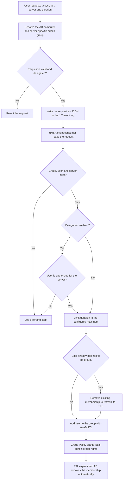

# Just-In-Time Solution for Active Directory Member Servers - Version 0.2.20261004.8 (dev)

## Project Description

T1JIT provides Just-In-Time (JIT) local administrator access to Active Directory member servers. It reduces the risk of lateral movement by granting elevated privileges only for an approved period. T1JIT uses native Active Directory capabilities and does not require agents or permanently privileged service accounts on target servers.

## Table of Contents

- [Problem Statement](#problem-statement)
- [How T1JIT Works](#how-t1jit-works)
    - [Temporary Privilege Assignment](#temporary-privilege-assignment)
- [Using the Web Interface](#using-the-web-interface)
- [Using T1JIT with PowerShell](#using-t1jit-with-powershell)
- [Quick-Start Installation](#quick-start-installation)
    - [Install T1JIT](#install-t1jit)
    - [Configure Elevation Privileges](#configure-elevation-privileges)
- [Installing and Configuring KjitWeb](#installing-and-configuring-kjitweb)
    - [Install KjitWeb](#install-kjitweb)
        - [Restrict KjitWeb Clients (`AllowedClient`)](#restrict-kjitweb-clients-allowedclient)
        - [Publish KjitWeb as a Microsoft Entra Enterprise Application](#publish-kjitweb-as-a-microsoft-entra-enterprise-application)
    - [Update KjitWeb](#update-kjitweb)
    - [Configure KjitWeb](#configure-kjitweb)
- [Add Additional JIT Servers](#add-additional-jit-servers)
- [Security Considerations](#security-considerations)
- [PowerShell Command Reference](#powershell-command-reference)
    - [Get-JitConfig](#get-jitconfig)
    - [Get-AdminStatus](#get-adminstatus)
    - [Get-UserElevationStatus](#get-userelevationstatus)
    - [Get-JitDelegation](#get-jitdelegation)
    - [Get-JitServerOU](#get-jitserverou)
    - [Remove-JitDelegation](#remove-jitdelegation)
    - [Remove-JitServerOU](#remove-jitserverou)
    - [Add-JitDelegation](#add-jitdelegation)
    - [Add-JitServerOU](#add-jitserverou)
- [Monitoring](#monitoring)
- [Advanced Setup](#advanced-setup)
    - [Full Configuration Wizard](#full-configuration-wizard)
    - [Unattended Installation](#unattended-installation)
    - [Parameterized KjitWeb Installation](#parameterized-kjitweb-installation)
    - [Installation Prompts](#installation-prompts)
- [Disclaimer](#disclaimer)
- [License](#license)
- [Changelog](#changelog)
- [Windows Event Reference](#windows-event-reference)

## Problem Statement

Permanent local administrator memberships create a reusable attack path between servers. If one server is compromised, an attacker can use those privileges to move laterally to other systems. Agent-based solutions and permanently privileged service identities can introduce additional attack paths. T1JIT avoids permanent privileged identities on target servers and limits administrator access to the requested lifetime.

## How T1JIT Works

T1JIT uses the Active Directory **Privileged Access Management** optional feature only for TTL-based group memberships. It does not implement the complete Microsoft PAM architecture; specifically, it does not require a separate bastion forest or Microsoft Identity Manager. The PAM feature allows T1JIT to add a user to an administrator group for a defined lifetime so that Active Directory removes the membership automatically when the TTL expires.

Users submit requests through KjitWeb or PowerShell. Each request identifies a target server and elevation duration. A group managed service account (gMSA) validates the request against the configured delegations and, when authorized, adds the user to the server-specific administrator group with an Active Directory TTL. Group Policy places that group in the target server's local Administrators group. T1JIT creates server-specific groups for computer objects in configured search bases and Active Directory removes temporary memberships automatically when their TTL expires.

### Temporary Privilege Assignment


```mermaid
flowchart TD
    Request[User requests access to a server and duration] --> ResolveServer[Resolve the AD computer and server-specific admin group]
    ResolveServer --> RequestAllowed{Request is valid and delegated?}
    RequestAllowed -->|No| RejectRequest[Reject the request]
    RequestAllowed -->|Yes| EventLog[Write the request as JSON to the JIT event log]
    EventLog --> Consumer[gMSA event consumer reads the request]
    Consumer --> ObjectsExist{Group, user, and server exist?}
    ObjectsExist -->|No| RejectEvent[Log error and stop]
    ObjectsExist -->|Yes| Delegation{Delegation enabled?}
    Delegation -->|Yes| Authorized{User is authorized for the server?}
    Authorized -->|No| RejectEvent
    Authorized -->|Yes| LimitDuration[Limit duration to the configured maximum]
    Delegation -->|No| LimitDuration
    LimitDuration --> Existing{User already belongs to the group?}
    Existing -->|Yes| RemoveExisting[Remove existing membership to refresh its TTL]
    Existing -->|No| AddWithTtl[Add user to the group with an AD TTL]
    RemoveExisting --> AddWithTtl
    AddWithTtl --> LocalAdmin[Group Policy grants local administrator rights]
    LocalAdmin --> Expire[TTL expires and AD removes the membership automatically]
```

## Using the Web Interface

> [!IMPORTANT]
> KjitWeb can request privileged access and must only be reachable from trusted, managed computers or through a trusted access proxy. Do not expose the KjitWeb service or port `5240` directly to the Internet. Restrict the Windows Firewall rule and all network security controls to the required management clients or proxy connectors, and use HTTPS for every connection that can carry credentials.
>
> In Microsoft Azure environments, publish KjitWeb through Microsoft Entra Application Proxy as an Enterprise Application. Require Microsoft Entra pre-authentication and apply Conditional Access policies such as MFA and a compliant or managed device. Block direct client access to the internal KjitWeb URL; otherwise, users could bypass Conditional Access and MFA.

KjitWeb provides a browser interface for requesting temporary administrator access. Open `http://<server>.<domain>:5240`, select a target server and elevation duration, and submit the request. The server list contains only delegated computers with a matching JIT administrator group and displays each server by its fully qualified DNS name. The interface also shows active elevations and their remaining time.

## Using T1JIT with PowerShell

Administrators can request temporary local administrator privileges directly from PowerShell. The T1JIT PowerShell module must be installed on the computer, and the user or one of their groups must have a JIT delegation for the organizational unit that contains the target server. No permission to modify Active Directory groups is required.

Import the module and request access to a server for a specific number of minutes:

```powershell
Import-Module Just-In-time
New-AdminRequest -Server "server01.contoso.com" -Minutes 30
```

If `-Minutes` is omitted, the configured default elevation time is used. Values outside the configured limits are adjusted to the allowed minimum or maximum. To display the current user's active elevations and their remaining time, run:

```powershell
Get-AdminStatus
```

After the request has been processed, start a new sign-in session on the target server so that the temporary group membership is included in the user's access token. The Active Directory TTL automatically removes the membership when the approved time expires.

## Quick-Start Installation

If the Active Directory Privileged Access Management feature is not enabled, an Enterprise Administrator must enable it. When installation is performed without Domain Administrator permissions, prepare these prerequisites first:

- A valid Active Directory KDS root key for the gMSA.
- The `\\<domain>\SYSVOL\<domain>\Just-In-Time` folder.
- An OU for server-specific administrator groups, for example `OU=JIT-Administrator Groups,OU=Tier 1,OU=Admin,DC=<domain>`.
- A gMSA that the JIT server is allowed to retrieve and that can create group objects in the administrator-group OU.
- Local administrator membership on the JIT server.
- Permission to create files in `\\<domain>\SYSVOL\<domain>\Just-In-Time`.

### Install T1JIT

1. Download the latest installation package and extract it into a temporary directory.
2. Open an elevated Windows PowerShell session. Perform the following steps as a Domain Administrator or as a local administrator on the JIT server. When using an account that is **not** a Domain Administrator, all prerequisites and delegated permissions listed above must already be in place.
3. Run `install-JIT.ps1` from the extracted package. The script installs T1JIT and starts `Config-JIT.ps1` automatically. Accept the default `Y` at the KjitWeb prompt to install the web interface. If an existing installation is detected, the script updates T1JIT and KjitWeb in place while preserving their configuration.
4. Configure the Group Policy that assigns local administrator rights on the target servers. The installer copies the provisioning script to `%ProgramFiles%\Just-In-Time\New-T1JitLocalAdministratorsGpo.ps1` and displays a prominent reminder when installation completes. Run the script as a Domain Administrator or as a member of **Group Policy Creator Owners** that also has permission to link GPOs to the configured server OUs. The script reads the active JIT configuration and creates one complete GPO per configured domain. Preview it with:

   ```powershell
   & "$env:ProgramFiles\Just-In-Time\New-T1JitLocalAdministratorsGpo.ps1" -WhatIf -Verbose
   ```

   See the complete, language-neutral documentation in [`GroupPolicy`](GroupPolicy/README.md), and test the policies in non-production server OUs before rollout.

### Configure Elevation Privileges

1. Open an elevated Windows PowerShell session on the JIT server with permission to update the delegation configuration.
2. Review the default delegation. During a fresh installation, `Config-JIT.ps1` automatically delegates the owning domain's Domain Admins group on every configured server search base. `Add-JitServerOU` applies the same default when a new search base is added later, and `Remove-JitServerOU` removes the matching delegation when that search base is removed.
3. Grant a user or group permission to request elevation for servers in a specific OU by running `Add-JitDelegation`. Supply the target OU as a distinguished name and the Active Directory identity as a UPN, `DOMAIN\Name`, or another name accepted by Active Directory:

   ```powershell
   Add-JitDelegation `
       -OU "OU=Servers,DC=contoso,DC=com" `
       -ADobject "CONTOSO\Server-Admins"
   ```

   The delegation applies to matching servers in the specified OU and its child OUs. Use more specific child OUs when different administration teams require separate scopes. For example:

   ```powershell
   Add-JitDelegation `
       -OU "OU=SQL,OU=Servers,DC=contoso,DC=com" `
       -ADobject "CONTOSO\SQL-Admins"
   ```

4. Verify the configured elevation privileges:

   ```powershell
   Get-JitDelegation
   ```

## Installing and Configuring KjitWeb

### Install KjitWeb

KjitWeb is installed as part of the standard `install-JIT.ps1` workflow. After T1JIT configuration completes, accept the default `Y` at the KjitWeb prompt. The installer then runs `install-kjitweb.ps1` automatically on the current JIT server; no separate setup command is required.

#### Restrict KjitWeb Clients (`AllowedClient`)

`install-kjitweb.ps1` accepts an `-AllowedClient` parameter that controls which clients may connect to the KjitWeb TCP port. It accepts hostnames/FQDNs, IP addresses, CIDR subnets, `localhost`, or `*`. Supply multiple entries as a PowerShell array or separate them with commas or semicolons. Loopback (`127.0.0.1` and `::1`) and every active local IPv4/IPv6 interface address of the KjitWeb server are always added to the effective access list. Loopback traffic remains local and is therefore not passed to the Windows Firewall `RemoteAddress` parameter.

- **`localhost` (default)** – Only the KjitWeb server itself is allowed. Access works through `localhost`, both loopback addresses, and the server's active local interface addresses. The service listens on all local interfaces, while Windows Firewall rejects connections whose source address does not belong to the local system. Use this when KjitWeb is only ever browsed from the server itself, or when access is brokered entirely through another mechanism such as Microsoft Entra Application Proxy (see below).
- **One or more restricted clients**, for example `-AllowedClient "192.168.10.0/24", "192.168.11.0/26", "localhost"` – KjitWeb binds to all interfaces (`http://*:5240`), while the Windows Firewall rule permits only the resolved host addresses, individual IP addresses, and CIDR subnets in the list, plus the automatically detected local system addresses. The installer/updater also verifies that the Kerberos SPNs `HTTP/<hostname>` and `HTTP/<fqdn>` are registered on the server's computer account, registering them automatically if missing (see [Kerberos authentication setup](docs/Kerberos-Setup.md)).
- **`*`** – KjitWeb binds to all interfaces and accepts connections from any remote address. Only use this when another control, such as a firewall, IPsec, mutual TLS, or an access proxy, already restricts who can reach the KjitWeb port; do not expose it directly to untrusted networks.

If you need to change `AllowedClient` after the initial installation (for example because access requirements changed, or because a client that used to reach KjitWeb via its hostname stopped working), use `set-kjitweb-allowedclient.ps1`. Since installation/update, it is available directly in the KjitWeb installation folder (`C:\Program Files\KJITWEB` by default) next to `install-kjitweb.ps1` and `update-kjitweb.ps1` — you do not need to keep or re-extract the release package to run it:

```powershell
cd 'C:\Program Files\KJITWEB'
.\set-kjitweb-allowedclient.ps1 -AllowedClient `
    "192.168.10.0/24", `
    "192.168.11.0/26", `
    "localhost"
```

The same entries can be supplied through the pipeline:

```powershell
"192.168.10.0/24", "192.168.11.0/26", "2001:db8:10::/64", "localhost" |
    .\set-kjitweb-allowedclient.ps1
```

Use `-Add` or `-Remove` to modify the stored list without replacing all entries:

```powershell
.\set-kjitweb-allowedclient.ps1 -Add "10.0.3.0/24", "2001:db8:20::/64"
.\set-kjitweb-allowedclient.ps1 -Remove "192.168.11.0/26"
```

Both parameters may be combined in one call. `-WhatIf` calculates and displays the resulting configuration without changing appsettings, the service, URL ACL, or firewall:

```powershell
.\set-kjitweb-allowedclient.ps1 -Add "10.0.3.0/24" -WhatIf
```

The script returns a `KjitWeb.AllowedClientConfiguration` object containing the configured and effective allow lists, including separate `IPv4Addresses`, `IPv4Subnets`, `IPv6Addresses`, and `IPv6Subnets` properties. `Operation` identifies whether entries were replaced, added, or removed, and `Applied` is `False` for `-WhatIf`. The configured list contains the requested entries; the effective list additionally contains the automatically allowed local addresses.

To list the IP addresses and subnets currently effective for the installed service, run:

```powershell
.\get-kjitweb-allowedclient.ps1
```

The command returns one object per effective address. IPv4 and IPv6 entries can be filtered using the `AddressFamily` property:

```powershell
.\get-kjitweb-allowedclient.ps1 |
    Where-Object AddressFamily -eq 'IPv6'
```

This updates `appsettings.json`/`appsettings.Production.json` (`AllowedClient`, `ServiceUrl`, `AllowedHosts`), the service's `ASPNETCORE_URLS` registry value, the HTTP.sys URL-ACL reservation, the Windows Firewall rule, and the Kerberos SPN registration on the computer account, all consistently together, then restarts the KjitWeb service — without stopping and recreating the Windows service the way re-running `install-kjitweb.ps1` would. If anything fails partway through, it automatically restores the previous configuration.

Do not edit `AllowedClient` directly in `appsettings.json` or `appsettings.Production.json`. That change alone does not update the service binding, URL ACL, or firewall rule and can make KjitWeb unavailable. `update-kjitweb.ps1` (see [Update KjitWeb](#update-kjitweb)) preserves `AllowedClient`; use `set-kjitweb-allowedclient.ps1` to change this setting safely.

#### Publish KjitWeb as a Microsoft Entra Enterprise Application

For Azure-connected environments, use Microsoft Entra Application Proxy to publish the internally hosted KjitWeb service:

1. Install a Microsoft Entra private network connector on a domain-joined Windows server that can reach the internal KjitWeb URL. For production, use a dedicated connector group with at least two connectors.
2. In the Microsoft Entra admin center, open **Enterprise applications**, create a new **on-premises application**, and enter the internal KjitWeb URL, for example `http://kjitweb.contoso.com:5240`.
3. Select **Microsoft Entra ID** as the pre-authentication method, choose the dedicated connector group, and enable **User assignment required**. Assign only the administrator groups that are allowed to use KjitWeb.
4. For seamless sign-on, configure **Integrated Windows Authentication**. Register the internal `HTTP/kjitweb.contoso.com` SPN for the identity that runs KjitWeb and configure Kerberos constrained delegation from the connector computer accounts only to this SPN. Verify the SPN and delegation configuration before enabling access.
5. Create a Conditional Access policy that targets the KjitWeb Enterprise Application and requires MFA. Restrict access further to compliant or Microsoft Entra hybrid joined management devices and approved locations as required by the organization.
6. Restrict inbound access to the KjitWeb port to the private network connector servers, test sign-in and JIT requests through the external Application Proxy URL, and confirm that the internal URL is not reachable from user networks.

Use HTTPS for the internal connector-to-KjitWeb connection whenever possible. Microsoft Entra Application Proxy protects the external endpoint, but it does not remove the need to secure the internal network path. Microsoft Entra Application Proxy and Conditional Access require suitable Microsoft Entra licensing.

### Update KjitWeb

Use `update-kjitweb.ps1`, located next to `install-kjitweb.ps1`, to update an existing KjitWeb installation without losing its configuration. Re-running `install-kjitweb.ps1` performs a clean reinstall; `update-kjitweb.ps1` is the preferred in-place update method.

`install-JIT.ps1` does this automatically: when it detects a `KjitWeb` service backed by an already-deployed `KjitWeb.exe`, it calls `update-kjitweb.ps1` instead of `install-kjitweb.ps1`, so no AllowedClient/CompanyName/Port/DebugLogPath prompts (or parameters) are needed to refresh an already installed service. You only need to run `update-kjitweb.ps1` directly if you want to update KjitWeb without going through install-JIT.ps1.

The script performs these steps:

- Stops the `KjitWeb` service.
- Creates a temporary rollback backup of the current installation.
- Replaces the application files from the `publish-service` folder next to the script, while preserving `appsettings*.json` and the `app_data` folder.
- Copies `install-kjitweb.ps1`, `update-kjitweb.ps1`, `set-kjitweb-allowedclient.ps1`, and `get-kjitweb-allowedclient.ps1` into the installation folder, so they remain available for the next update, reconfiguration, or inspection even after the original release package/extraction folder is gone.
- Ensures the `NetworkService` account, the HTTP.sys URL-ACL reservation, the Windows Firewall rule matching the configured `AllowedClient`, and the Kerberos SPN registration on the computer account are all still correct — restoring any of them that were missing or manually changed, even on installations that predate these safeguards. If the account running the script lacks permission to register the SPN, a warning with the manual `setspn` command is shown instead of failing the update.
- Restarts the service and removes the temporary backup on success.
- Automatically restores the previous installation and rethrows the error if the update fails.

```powershell
.\update-kjitweb.ps1
```

Optional parameters:

- `-SourceServiceFolder`: Folder containing the new published KjitWeb files. Defaults to the `publish-service` folder next to the script.
- `-InstallServiceFolder`: Existing KjitWeb installation folder. Defaults to `%ProgramFiles%\KJITWEB`.
- `-ServiceName`: Name of the installed Windows service. Defaults to `KjitWeb`.

```powershell
.\update-kjitweb.ps1 -InstallServiceFolder "D:\Services\KJITWEB"
```

> [!NOTE]
> `update-kjitweb.ps1` must be run with administrator privileges. For the core JIT PowerShell module, re-run `install-JIT.ps1` on an existing installation: it detects the existing `JIT.config` (or a previously installed `Config-JIT.ps1`) automatically, skips the installation-directory prompt, and only asks for configuration settings introduced by a newer version.

### Configure KjitWeb

Configure KjitWeb in `appsettings.json` or `appsettings.Production.json`. Use the management scripts for settings, such as `AllowedClient`, that also affect HTTP.sys, Windows Firewall, or service configuration.

- **`Branding:LogoPath`** – URL path of the logo below `wwwroot`, for example `/images/logo.png`.
- **`Branding:CompanyName`** – Company name displayed in the top bar. The default is `Contoso Ltd.`.
- **`AllowedHosts`** – Host-header allow list. The default `*` accepts any host header.
- **`DebugLog:Path`** – Optional debug-log file path. The `DebugLog__Path` environment variable overrides this value. The service account must have write permission to the target directory.

If `DebugLog:Path` is omitted, KjitWeb writes `KjitWeb\debug.log` below the service account's AppData directory. The active file is limited to 1 MiB; when the next entry would exceed the limit, KjitWeb moves it to `debug.sav` and replaces any older saved log. Oversized individual entries are truncated and marked. At service startup, Application event `5001` records the resolved debug-log path.

## Add Additional JIT Servers

1. Join the additional server to a domain in the same Active Directory forest and verify that it can access the shared `JIT.config`.
2. Download and extract the same T1JIT installation package.
3. Open an elevated Windows PowerShell session and run the installer with the existing configuration:

   ```powershell
   .\install-JIT.ps1 `
       -JitConfigFile '\\contoso.com\SYSVOL\contoso.com\Just-In-Time\JIT.config'
   ```

4. Confirm that both scheduled tasks under `\Just-In-Time-Privilege\` use the configured gMSA and run successfully.
5. If KjitWeb is required on the additional server, accept the KjitWeb installation prompt and configure the appropriate client restrictions.

## Security Considerations

- Restrict KjitWeb to trusted management clients or access-proxy connectors; never expose port `5240` directly to the Internet.
- Use HTTPS whenever credentials or authentication tokens can cross an untrusted network segment.
- For remote access, publish KjitWeb through Microsoft Entra Application Proxy or an equivalent trusted proxy and enforce pre-authentication, MFA, and device-based Conditional Access.
- Block direct access to the internal KjitWeb URL when a proxy is used so users cannot bypass its controls.
- Grant delegation only to the required users or groups and scope each delegation to the narrowest appropriate server OU.
- Monitor the `Tier 1 Management` and Application event logs for rejected requests, processing failures, and service startup errors.

## PowerShell Command Reference

The installed `Just-In-time` module provides commands for reading configuration, checking elevation status, and managing server search bases and delegations.

### Get-JitConfig

Returns the active T1JIT configuration as an object.

**Parameters**

- `configurationFile` – Optional path to a `JIT.config` file. When omitted, the command uses the standard configuration-source resolution.

**Examples**

```powershell
Get-JitConfig
Get-JitConfig -configurationFile 'C:\Config\JIT.config'
```

### Get-AdminStatus

Returns the active JIT administrator assignments and remaining TTL for a user.

**Parameters**

- `User` – Optional user name or Active Directory user object. When omitted, the command checks the current user. Pipeline input is supported.

**Examples**

```powershell
Get-AdminStatus
Get-AdminStatus -User 'user@contoso.com'
Get-ADUser -Identity 'user' | Get-AdminStatus
```

### Get-UserElevationStatus

Tests whether a user is authorized to request elevation for a target server.

**Parameters**

- `ServerName` – Target computer name, FQDN, `DOMAIN\ComputerName`, or canonical name.
- `UserName` – User name, UPN, `DOMAIN\UserName`, or canonical name.
- `DelegationConfig` – Optional path to the delegation JSON file.
- `AllowManagedByAttribute` – Determines whether the computer's `ManagedBy` value may grant access. The default is `$true`.

**Example**

```powershell
Get-UserElevationStatus `
    -ServerName 'server01.contoso.com' `
    -UserName 'user@contoso.com' `
    -DelegationConfig '\\contoso.com\SYSVOL\contoso.com\Just-In-Time\Tier1delegation.config'
```

The command returns `$true` when the user is authorized and `$false` otherwise.

### Get-JitDelegation

Returns all configured delegation OUs and translates their stored SIDs to account names.

**Example**

```powershell
Get-JitDelegation
```

### Get-JitServerOU

Displays the configured server search bases and returns the complete T1JIT configuration object.

**Example**

```powershell
(Get-JitServerOU).T1Searchbase
```

### Remove-JitDelegation

Removes either one delegated user or group from an OU entry, or the complete OU delegation.

**Parameters**

- `OU` – Distinguished name of the delegated organizational unit.
- `ADObject` – Optional user or group to remove. When omitted, the complete OU entry is removed.
- `Force` – Removes the delegation without an interactive confirmation prompt.

**Examples**

```powershell
Remove-JitDelegation `
    -OU 'OU=Servers,DC=contoso,DC=com' `
    -ADObject 'CONTOSO\Server-Admins'

Remove-JitDelegation `
    -OU 'OU=Servers,DC=contoso,DC=com' `
    -Force
```

### Remove-JitServerOU

Removes a server search base and every delegation that targets the same OU.

**Parameters**

- `OU` – Distinguished name of the search base to remove. Pipeline input is supported.

**Example**

```powershell
Remove-JitServerOU -OU 'OU=Servers,DC=contoso,DC=com'
```

### Add-JitDelegation

The `Add-JitDelegation` command allows an Active Directory user or group to request elevation for servers in an OU and its child OUs.

**Parameters**

- `OU` – Distinguished name of the organizational unit containing the target servers.
- `ADobject` – Active Directory user or group to delegate. Supported values include a UPN, `DOMAIN\Name`, or another name accepted by Active Directory.

**Example**

```powershell
Add-JitDelegation `
    -OU 'OU=Servers,DC=contoso,DC=com' `
    -ADobject 'CONTOSO\Server-Admins'
```

This allows the `CONTOSO\Server-Admins` group to request elevation for matching servers in the `Servers` OU and its child OUs.

### Add-JitServerOU

Adds an Active Directory search base to the T1JIT configuration and grants the owning domain's Domain Admins group default delegation when delegation mode is enabled.

**Parameters**

- `OU` – Distinguished name of the search base to add. Pipeline input is supported.

**Example**

```powershell
Add-JitServerOU -OU 'OU=Servers,DC=contoso,DC=com'
```

## Monitoring

T1JIT records elevation requests, processing results, group provisioning, and service startup diagnostics in Windows Event Log. Monitor these logs on the JIT server:

- **Tier 1 Management** with source `T1Mgmt` – Contains JIT elevation requests and their processing results as well as Tier 1 administrator-group provisioning events. The log and source names can be changed in `JIT.config`.
- **Application** with source `KjitWeb` – Contains KjitWeb startup diagnostics.
- **Application** with source `T1JIT Tier1LocalAdminGroup` – Contains script-level diagnostics for the scheduled group-management task.

For the complete event-ID reference, including event levels, meanings, log sources, and troubleshooting guidance, see [`EVENTS.md`](EVENTS.md).

Display the latest T1JIT events:

```powershell
Get-WinEvent -LogName 'Tier 1 Management' -MaxEvents 50 |
    Select-Object TimeCreated, Id, LevelDisplayName, ProviderName, Message
```

Display warnings and errors from the last 24 hours:

```powershell
Get-WinEvent -FilterHashtable @{
    LogName   = 'Tier 1 Management'
    Level     = 2, 3
    StartTime = (Get-Date).AddHours(-24)
} | Select-Object TimeCreated, Id, LevelDisplayName, Message
```

Display KjitWeb and group-management diagnostics from the Application log:

```powershell
Get-WinEvent -FilterHashtable @{
    LogName      = 'Application'
    ProviderName = 'KjitWeb', 'T1JIT Tier1LocalAdminGroup'
    StartTime    = (Get-Date).AddHours(-24)
} | Select-Object TimeCreated, Id, LevelDisplayName, ProviderName, Message
```

KjitWeb also displays an orange warning symbol or a red error symbol next to its version number when a relevant warning or error was written to the configured event log during the last 24 hours. Event IDs `2003` and `2009` are excluded because they represent normal limit enforcement rather than operational failures.

## Advanced Setup

The standard installation requires only `install-JIT.ps1`. Use the following advanced options when an existing configuration must be reviewed, an installation must run without prompts, or KjitWeb settings must be supplied explicitly.

### Full Configuration Wizard

An update normally retains the existing settings and asks only for configuration values introduced by a newer release. To review every configuration value again, open an elevated Windows PowerShell session in the installed JIT directory and run:

```powershell
Push-Location "$env:ProgramFiles\Just-In-Time"
try {
    .\Config-JIT.ps1 -AdvancedSetup
}
finally {
    Pop-Location
}
```

The advanced wizard includes all standard configuration questions and additionally asks:

- **Enable delegation mode** – Controls whether requests must match entries in the delegation control file. The default is `Y`. Disabling delegation allows every authenticated user to request elevation for managed servers and should therefore be used only in explicitly approved environments.
- **LDAP query for Tier 1 computers** – Replaces the default computer search filter used within the configured search bases. Supply a valid LDAP filter that selects only the intended managed computer objects.

### Unattended Installation

Use `-silent` together with an existing `JIT.config` file to install or update T1JIT without interactive JIT configuration prompts. Add `-InstallWeb` to install KjitWeb and supply its values as parameters so that its installer does not prompt:

```powershell
.\install-JIT.ps1 `
    -silent `
    -JitProgramFolder 'C:\Program Files\Just-In-Time' `
    -JitConfigFile '\\contoso.com\SYSVOL\contoso.com\Just-In-Time\JIT.config' `
    -InstallWeb `
    -AllowedClient 'adminpc01.contoso.com' `
    -CompanyName 'Contoso Ltd.' `
    -Port 5240 `
    -DebugLogPath 'C:\ProgramData\KJITWEB\debug.log'
```

The parameters have the following purposes:

- `JitProgramFolder` selects the JIT installation directory.
- `JitConfigFile` supplies an existing configuration file. Silent configuration requires this parameter or an existing machine-level `JustInTimeConfig` environment variable.
- `InstallWeb` includes KjitWeb in a silent installation.
- `AllowedClient`, `CompanyName`, `Port`, and `DebugLogPath` provide the KjitWeb settings that would otherwise be requested interactively.

When an existing KjitWeb installation is detected, `install-JIT.ps1` runs `update-kjitweb.ps1` and preserves its existing client, branding, port, and debug-log configuration.

### Parameterized KjitWeb Installation

KjitWeb is normally installed automatically by `install-JIT.ps1`. If the web service must be installed separately, run the packaged `install-kjitweb.ps1` from an elevated Windows PowerShell session and provide the required values explicitly:

```powershell
.\kJITWeb\install-kjitweb.ps1 `
    -JitConfig '\\contoso.com\SYSVOL\contoso.com\Just-In-Time\JIT.config' `
    -AllowedClient 'adminpc01.contoso.com' `
    -CompanyName 'Contoso Ltd.' `
    -Port 5240 `
    -DebugLogPath 'C:\ProgramData\KJITWEB\debug.log'
```

- `JitConfig` identifies the configuration used by the PowerShell and KjitWeb components.
- `AllowedClient` accepts one or more hostnames, IP addresses, CIDR subnets, and `localhost`, or the standalone wildcard `*`.
- `CompanyName` sets the branding shown in the web interface.
- `Port` selects the KjitWeb listening port.
- `DebugLogPath` overrides the KjitWeb debug-log file path.

### Installation Prompts

Although configuration is implemented by separate internal scripts, the user starts only `install-JIT.ps1`. Press Enter to accept the value shown in square brackets. A standard interactive installation asks for the following information:

1. **Installation directory** – Location for the JIT program files. The default is `C:\Program Files\Just-In-Time`.
2. **Administrator group prefix** – Prefix used to construct the server-specific administrator group names. The default is `Admin_`.
3. **Group Managed Service Account name** – Name of the gMSA that processes JIT events and manages the temporary group memberships. The name must contain between 5 and 14 characters.
4. **Delegation control file** – Location of the JSON file that stores JIT delegations. The default is `\\<domain>\SYSVOL\<domain>\Just-In-Time\Tier1delegation.config`.
5. **Debug log directory** – Directory used for diagnostic logging. Environment variables such as `%TEMP%` and UNC paths are supported.
6. **OU for local administrator groups** – Distinguished name of the OU in which the server-specific administrator groups are stored. The installer can create a missing OU hierarchy when the executing account has sufficient permissions.
7. **Maximum elevation time** – Longest permitted temporary elevation, between 15 and 1440 minutes. The default is 1440 minutes.
8. **Default elevation time** – Elevation duration used when the requester does not select another value. It must be between 15 minutes and the configured maximum; the default is 60 minutes.
9. **Tier 0 computers group** – Existing Active Directory group whose computers are excluded from Tier 1 JIT administration. The default name is `Tier 0 Computers`.
10. **Tier 0 OU** – Relative distinguished name of the Tier 0 computer OU below the current domain root. The default is `OU=Tier 0,OU=Admin`.
11. **Group evaluation interval** – Number of minutes between evaluations of the Tier 1 administrator groups. Valid values are 5 through 1439; the default is 5 minutes.
12. **JIT computer search bases** – One or more OU or CN distinguished names containing managed computer objects. The installer repeatedly asks whether another search base should be added. If none is added, the current domain root is used.
13. **Configuration file path** – Location at which `JIT.config` is stored. The recommended default is `\\<domain>\SYSVOL\<domain>\Just-In-Time\JIT.config`.
14. **Install KjitWeb** – Confirm with the default `Y`. `install-JIT.ps1` then invokes the KjitWeb installer automatically and passes it the newly created JIT configuration.
15. **Allowed KjitWeb clients** – One or more hostnames, IP addresses, CIDR subnets, or `localhost` that may access KjitWeb. Separate multiple entries with commas or semicolons. The default is `localhost`; `*` allows all clients and cannot be combined with restricted entries.
16. **Company name** – Display name shown in the KjitWeb interface. The default is `Active Directory Just-in-Time Administration`.
17. **KjitWeb TCP port** – Listening port for the web service. The default is `5240`; if it is already in use, another available port must be entered.

Development, build, versioning, release, and contribution information is maintained separately in [`Developer.md`](Developer.md).

## Disclaimer

This project is not supported under any Microsoft standard support program or service. Unless required by applicable law or agreed to in writing, the software is distributed on an **"AS IS" BASIS, WITHOUT WARRANTIES OR CONDITIONS OF ANY KIND**, either express or implied. See the Apache License 2.0 for the specific language governing permissions and limitations.

## License

Copyright 2024 Andreas Lucas.

This project is licensed under the [Apache License 2.0](LICENSE).

## Changelog

User- and administrator-facing changes are documented in [`CHANGELOG.md`](CHANGELOG.md), grouped by version. For the raw per-push audit trail of commits and changed files, see [`History.md`](History.md).

## Windows Event Reference

Every Windows Event Log entry written by T1JIT (event IDs, the log/source they use, and what they mean) is documented in [`EVENTS.md`](EVENTS.md). Use it to look up an event ID seen in the `Tier 1 Management` or `Application` log without having to read the source code.
