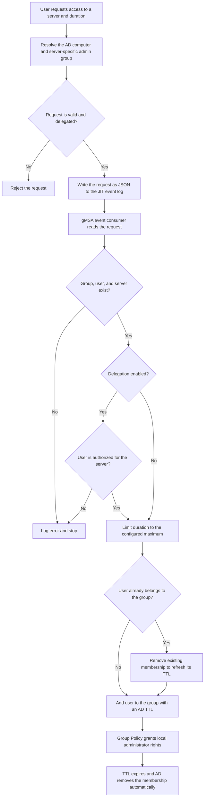

# Just-In-Time Solution for Active Directory Member Servers

## Table of Contents

- [Project Description](#project-description)
- [Problem Statement](#problem-statement)
- [How does T1JIT works](#how-does-t1jit-works)
    - [Temporary privilege assignment](#temporary-privilege-assignment)
- [Using the Web Interface](#using-the-web-interface)
- [Using T1JIT with PowerShell](#using-t1jit-with-powershell)
- [Quick-start Installation](#quick-start-installation)
    - [Install Just-In-Time](#install-just-in-time)
    - [Configure elevation privileges](#configure-elevation-privileges)
    - [Usage of JIT](#usage-of-jit)
- [Installing and configuring KJIT-Web](#installing-and-configuring-kjit-web)
    - [Installation of the KJIT-Web service](#installation-of-the-kjit-web-service)
        - [Restricting which clients can reach KjitWeb (AllowedClient)](#restricting-which-clients-can-reach-kjitweb-allowedclient)
        - [Publish KjitWeb as a Microsoft Entra Enterprise Application](#publish-kjitweb-as-a-microsoft-entra-enterprise-application)
    - [Updating the KJIT-Web service](#updating-the-kjit-web-service)
    - [Configuration of the KJIT-Web service](#configuration-of-the-kjit-web-service)
- [Setup additional JIT servers](#setup-additional-jit-servers)
- [Security Considerations](#security-considerations)
- [Configuration and Customization](#configuration-and-customization)
    - [Get-JITConfig](#get-jitconfig)
    - [Get-AdminStatus](#get-adminstatus)
    - [Get-UserElevationStatus](#get-userelevationstatus)
    - [Get-JITDelegation](#get-jitdelegation)
    - [Get-JITServerOU](#get-jitserverou)
    - [Remove-JITDelegation](#remove-jitdelegation)
    - [Remove-JITServerOU](#remove-jitserverou)
    - [Add-JitDelegation](#add-jitdelegation)
    - [Add-JITServerOU](#add-jitserverou)
- [Monitoring with Windows Event Log](#monitoring-with-windows-event-log)
- [Advanced setup](#advanced-setup)
    - [Full configuration wizard](#full-configuration-wizard)
    - [Unattended installation](#unattended-installation)
    - [Parameterized KjitWeb installation](#parameterized-kjitweb-installation)
    - [Installation prompts](#installation-prompts)
- [Disclaimer](#disclaimer)
- [License](#-license)
- [Changelog](#changelog)
- [Event Reference](#event-reference)

## Project Description

This project provides a Just-In-Time (JIT) solution for managing local administrator rights on Active Directory member servers. The goal is to reduce the risk of lateral movement in case of server compromise by ensuring that users are only temporarily granted elevated privileges.
This project is based on Active Directory features and do not required agents oder high privileged users on the target systems.

## Problem Statement

In many IT environments, users are members of the local administrators group on multiple servers. If one server is compromised, an attacker can exploit these privileges to move laterally across the network. Many existing solution requires Agents, high privileged or using privileged accounts in the background.
All ot those solutions provides a lateral movement attack path, because there is one high privileged identity on the target system.
This solution works without a privileged identity on the target computers.

## How does T1JIT works

T1JIT uses the Active Directory **Privileged Access Management** optional feature only
for TTL-based group memberships. It does not implement the complete Microsoft PAM
architecture; specifically, it does not require a separate bastion forest or Microsoft
Identity Manager. The PAM feature allows T1JIT to add a user to an administrator group
for a defined lifetime so that Active Directory removes the membership automatically when
the TTL expires.

T1JiT works with Active Directory groups and group polices. A user can connect to the KJIT-Web Service and select a target server and the elevation time. With the "request access" access button a request message is written to the Just-In-Time event log.
The event log is consumed from a group managed service account, who reads the event log and validate the user is allowed to request the access. If the user is allowed, the user object if time-bound added to the group who is member of the local administrator on the target server.
While the group where the user is added contains the target server in the name,only one group policy with a variable is required to assign the local administrator rights on the target server.
The user is automatically removed from the local administrator group after the time is expired.
The groups will be automatically created by the JIT-Solution, if a computer object exists in the configured target OU.

### Temporary privilege assignment


```mermaid
flowchart TD
    Request[User requests access to a server and duration] --> ResolveServer[Resolve the AD computer and server-specific admin group]
    ResolveServer --> RequestAllowed{Request is valid and delegated?}
    RequestAllowed -->|No| RejectRequest[Reject the request]
    RequestAllowed -->|Yes| EventLog[Write the request as JSON to the JIT event log]
    EventLog --> Consumer[gMSA event consumer reads the request]
    Consumer --> ObjectsExist{Group, user, and server exist?}
    ObjectsExist -->|No| RejectEvent[Log error and stop]
    ObjectsExist -->|Yes| Delegation{Delegation enabled?}
    Delegation -->|Yes| Authorized{User is authorized for the server?}
    Authorized -->|No| RejectEvent
    Authorized -->|Yes| LimitDuration[Limit duration to the configured maximum]
    Delegation -->|No| LimitDuration
    LimitDuration --> Existing{User already belongs to the group?}
    Existing -->|Yes| RemoveExisting[Remove existing membership to refresh its TTL]
    Existing -->|No| AddWithTtl[Add user to the group with an AD TTL]
    RemoveExisting --> AddWithTtl
    AddWithTtl --> LocalAdmin[Group Policy grants local administrator rights]
    LocalAdmin --> Expire[TTL expires and AD removes the membership automatically]
```

## Using the Web Interface

> [!IMPORTANT]
> KjitWeb can request privileged access and must only be reachable from trusted, managed computers or through a trusted access proxy. Do not expose the KjitWeb service or port `5240` directly to the Internet. Restrict the Windows Firewall rule and all network security controls to the required management clients or proxy connectors, and use HTTPS for every connection that can carry credentials.
>
> In Microsoft Azure environments, publish KjitWeb through Microsoft Entra Application Proxy as an Enterprise Application. Require Microsoft Entra pre-authentication and apply Conditional Access policies such as MFA and a compliant or managed device. Block direct client access to the internal KjitWeb URL; otherwise, users could bypass Conditional Access and MFA.

The KJIT-Web service provides a web interface for users to request administrator privileges on the target servers. Open `http://<server>.<domain>:5240` in a web browser, select the target server and elevation duration, and submit the request. The interface also displays active requests and their remaining elevation time.

## Using T1JIT with PowerShell

Administrators can request temporary local administrator privileges directly from PowerShell. The T1JIT PowerShell module must be installed on the computer, and the user or one of their groups must have a JIT delegation for the organizational unit that contains the target server. No permission to modify Active Directory groups is required.

Import the module and request access to a server for a specific number of minutes:

```powershell
Import-Module Just-In-time
New-AdminRequest -Server "server01.contoso.com" -Minutes 30
```

If `-Minutes` is omitted, the configured default elevation time is used. Values outside the configured limits are adjusted to the allowed minimum or maximum. To display the current user's active elevations and their remaining time, run:

```powershell
Get-AdminStatus
```

After the request has been processed, start a new sign-in session on the target server so that the temporary group membership is included in the user's access token. The Active Directory TTL automatically removes the membership when the approved time expires.

## Quick-start Installation

If the Privileged Access Management feature in Active Directory is not enabled,
Enterprise Administrator privileges are required to enable it.
If you install this JIT-Solution **not** as a Domain Administrator, the following
prerequisites must already be fulfilled:
- Validate Active Directory root-key from group managed service account exists
- Folder \\<domain>\\SYSVOL\<domain>\JUST-IN-TIME
- OU for the Just-In-Time groups e.g. OU=JIT-Administrator Groups,OU=Tier 1,OU=Admin,DC=<domain>
- Group Managed Service Account
    - Allow to retrieve password on the JIT server
    - Create group object in the JIT-Administrator Groups OU

Required installation permissions:
- Member of the local administrator groups
- Create file permission on \\<domain>\\SYSVOL\<domain>\JUST-IN-TIME

### Install Just-In-Time

1. Download the latest installation package and extract it into a temporary directory.
2. Open an elevated Windows PowerShell session. Perform the following steps as a Domain
   Administrator or as a local administrator on the JIT server. When using an account that
   is **not** a Domain Administrator, all prerequisites and delegated permissions listed
   above must already be in place.
3. Run the `install-JIT.ps1` script from the extracted installation package. This single
   script installs the JIT-Solution files and then automatically runs `config-JIT.ps1` to
   configure it. It also includes the KjitWeb installation; accept the default `Y` when
   prompted and the installer invokes the KjitWeb setup automatically. No separate
   installation or configuration script needs to be started. If it detects an existing
   installation, it updates the JIT-Solution and KjitWeb in place while preserving the
   existing configuration.
4. Configure the Group Policy that assigns local administrator rights on the target
   servers. The policy should contain a preference that adds
   `<AdminPrefix>%AD-DNSdomainname%<DomainSeparator>%<ComputerName>%` to the local
   Administrators group.

### Configure elevation privileges

During a fresh installation (not an update), config-JIT.ps1 automatically delegates the
owning domain's Domain Admins group on every configured search base, so JIT elevation
works immediately without running `Add-JitDelegation` by hand. `Add-JitServerOU` grants
the same default delegation whenever a new search base is added later, and
`Remove-JITServerOU` removes any matching delegation, including this default one, when
a search base is removed.

To allow a user to request administrators privileges on servers in a OU use the `Add-JitDelegation` command. This command will add user or group to be elevated on the target servers. The command should be run with the following parameters:
- Identity: The identity of the user or group who should be allowed to request administrators privileges on the target servers. The format should be <domain>\<username> or <domain>\<groupname>.
- OU: The OU where the computer objects of the target servers are located. The JIT
Solution will only work for computer objects who are located in this OU or its child OUs. A user will inherit the privileges to request administrators privileges on the target servers, if the user is member of a group who is allowed to request administrators privileges on the target servers.
create sub OU's below the target OU and delegate users / groups to this sub OU's to have a better structure and overview of the delegations.
e.g.
Add-JitDelegation -Identity "domain\serveradmins" -OU "OU=Server,DC=domain,DC=local"
    Any user who is member of the "domain\serveradmins" group will be able to request administrators privileges on the target servers who are located in the "OU=Server,DC=domain,DC=local" OU or its child OUs.
Add-JitDelegation -Identity "domain\SQLAdmins" -OU "OU=SQLServer,OU=Server,DC=domain,DC=local"
    Any user who is member of the "domain\SQLAdmins" group will be able to request administrators privileges on the target servers who are located in the "OU=SQLServer,OU=Server,DC=domain,DC=local" OU or its child OUs.
    Additional members of the "domain\serveradmins" group will also be able to request administrators privileges on the target servers who are located in the "OU=SQLServer,OU=Server,DC=domain,DC=local" OU or its child OUs, because the "domain\serveradmins" group is member of the "domain\SQLAdmins" group.

### Usage of JIT

A user can now request administrator privileges via Powershell without any privilege in active directory. To request administrator privileges for a target server the user can use the New-AdminRequest command. This command should be run with the following parameters:
- Server: The name of the target server. The format should be <computername>
- Duration: The duration for the elevation. The default value is 60 minutes. The maximum value is the value configured in the configuration of the JIT-Solution.
e.g.
    New-AdminRequest -Server myserver.domain.local
        This will request administrator privileges for the "myserver" server for 60 minutes. The user will be automatically removed from the local administrator group after 60 minutes.
    New-AdminRequest -Server myserver.domain.local -Duration 30
        This will request administrator privileges for the "myserver" server for 30 minutes. The user will be automatically removed from the local administrator group after 30 minutes.
    New-AdminRequest -Server myserver.domain.local -Duration 120 -User another user
        This will request administrator privileges for the "myserver" server for 120 minutes on behalf of the user "another user@

## Installing and configuring KJIT-Web

### Installation of the KJIT-Web service

KjitWeb is installed as part of the normal `install-JIT.ps1` workflow. After the JIT
configuration is complete, confirm the KjitWeb prompt with the default `Y`;
`install-JIT.ps1` then invokes `install-kjitweb.ps1` automatically. The user does not
need to start the KjitWeb installer separately. KjitWeb is installed on the current
computer, which must also host the JIT-Solution.

#### Restricting which clients can reach KjitWeb (AllowedClient)

`install-kjitweb.ps1` accepts an `-AllowedClient` parameter that controls which clients
may connect to the KjitWeb TCP port. It accepts hostnames/FQDNs, IP addresses, CIDR
subnets, `localhost`, or `*`. Supply multiple entries as a PowerShell array or separate
them with commas or semicolons. Loopback (`127.0.0.1` and `::1`) and every active local
IPv4/IPv6 interface address of the KjitWeb server are always added to the effective
access list. Loopback traffic remains local and is therefore not passed to the Windows
Firewall `RemoteAddress` parameter.

- **`localhost` (default)** – Only the KjitWeb server itself is allowed. Access works through `localhost`, both loopback addresses, and the server's active local interface addresses. The service listens on all local interfaces, while Windows Firewall rejects connections whose source address does not belong to the local system. Use this when KjitWeb is only ever browsed from the server itself, or when access is brokered entirely through another mechanism such as Microsoft Entra Application Proxy (see below).
- **One or more restricted clients**, for example
  `-AllowedClient "192.168.10.0/24", "192.168.11.0/26", "localhost"` – KjitWeb binds to
  all interfaces (`http://*:5240`), while the Windows Firewall rule permits only the
  resolved host addresses, individual IP addresses, and CIDR subnets in the list, plus the
  automatically detected local system addresses. The installer/updater also verifies that the Kerberos SPNs
  `HTTP/<hostname>` and `HTTP/<fqdn>` are registered on the server's computer account,
  registering them automatically if missing (see
  [Kerberos authentication setup](docs/Kerberos-Setup.md)).
- **`*`** – KjitWeb binds to all interfaces and accepts connections from any remote address. Only use this when another control, such as a firewall, IPsec, mutual TLS, or an access proxy, already restricts who can reach the KjitWeb port; do not expose it directly to untrusted networks.

If you need to change `AllowedClient` after the initial installation (for example because access requirements changed, or because a client that used to reach KjitWeb via its hostname stopped working), use `set-kjitweb-allowedclient.ps1`. Since installation/update, it is available directly in the KjitWeb installation folder (`C:\Program Files\KJITWEB` by default) next to `install-kjitweb.ps1` and `update-kjitweb.ps1` — you do not need to keep or re-extract the release package to run it:

```powershell
cd 'C:\Program Files\KJITWEB'
.\set-kjitweb-allowedclient.ps1 -AllowedClient `
    "192.168.10.0/24", `
    "192.168.11.0/26", `
    "localhost"
```

The same entries can be supplied through the pipeline:

```powershell
"192.168.10.0/24", "192.168.11.0/26", "2001:db8:10::/64", "localhost" |
    .\set-kjitweb-allowedclient.ps1
```

Use `-Add` or `-Remove` to modify the stored list without replacing all entries:

```powershell
.\set-kjitweb-allowedclient.ps1 -Add "10.0.3.0/24", "2001:db8:20::/64"
.\set-kjitweb-allowedclient.ps1 -Remove "192.168.11.0/26"
```

Both parameters may be combined in one call. `-WhatIf` calculates and displays the
resulting configuration without changing appsettings, the service, URL ACL, or firewall:

```powershell
.\set-kjitweb-allowedclient.ps1 -Add "10.0.3.0/24" -WhatIf
```

The script returns a `KjitWeb.AllowedClientConfiguration` object containing the
configured and effective allow lists, including separate `IPv4Addresses`, `IPv4Subnets`,
`IPv6Addresses`, and `IPv6Subnets` properties. `Operation` identifies whether entries were
replaced, added, or removed, and `Applied` is `False` for `-WhatIf`. The configured list
contains the requested entries; the effective list additionally contains the automatically
allowed local addresses.

To list the IP addresses and subnets currently effective for the installed service, run:

```powershell
.\get-kjitweb-allowedclient.ps1
```

The command returns one object per effective address. IPv4 and IPv6 entries can be
filtered using the `AddressFamily` property:

```powershell
.\get-kjitweb-allowedclient.ps1 |
    Where-Object AddressFamily -eq 'IPv6'
```

This updates `appsettings.json`/`appsettings.Production.json` (`AllowedClient`, `ServiceUrl`, `AllowedHosts`), the service's `ASPNETCORE_URLS` registry value, the HTTP.sys URL-ACL reservation, the Windows Firewall rule, and the Kerberos SPN registration on the computer account, all consistently together, then restarts the KjitWeb service — without stopping and recreating the Windows service the way re-running `install-kjitweb.ps1` would. If anything fails partway through, it automatically restores the previous configuration.

Do not edit `AllowedClient` directly in `appsettings.json`/`appsettings.Production.json` — that alone does not change the service binding, URL-ACL reservation, or firewall rule, so KjitWeb would stop working. `update-kjitweb.ps1` (see [Updating the KJIT-Web service](#updating-the-kjit-web-service)) deliberately never changes `AllowedClient`; it only refreshes the installed files and preserves the existing configuration. Re-running `install-kjitweb.ps1` also changes `AllowedClient`, but it performs a full reinstall (it stops and removes the existing service first) — prefer `set-kjitweb-allowedclient.ps1` for this specific change.

#### Publish KjitWeb as a Microsoft Entra Enterprise Application

For Azure-connected environments, use Microsoft Entra Application Proxy to publish the internally hosted KjitWeb service:

1. Install a Microsoft Entra private network connector on a domain-joined Windows server that can reach the internal KjitWeb URL. For production, use a dedicated connector group with at least two connectors.
2. In the Microsoft Entra admin center, open **Enterprise applications**, create a new **on-premises application**, and enter the internal KjitWeb URL, for example `http://kjitweb.contoso.com:5240`.
3. Select **Microsoft Entra ID** as the pre-authentication method, choose the dedicated connector group, and enable **User assignment required**. Assign only the administrator groups that are allowed to use KjitWeb.
4. For seamless sign-on, configure **Integrated Windows Authentication**. Register the internal `HTTP/kjitweb.contoso.com` SPN for the identity that runs KjitWeb and configure Kerberos constrained delegation from the connector computer accounts only to this SPN. Verify the SPN and delegation configuration before enabling access.
5. Create a Conditional Access policy that targets the KjitWeb Enterprise Application and requires MFA. Restrict access further to compliant or Microsoft Entra hybrid joined management devices and approved locations as required by the organization.
6. Restrict inbound access to the KjitWeb port to the private network connector servers, test sign-in and JIT requests through the external Application Proxy URL, and confirm that the internal URL is not reachable from user networks.

Use HTTPS for the internal connector-to-KjitWeb connection whenever possible. Microsoft Entra Application Proxy protects the external endpoint, but it does not remove the need to secure the internal network path. Microsoft Entra Application Proxy and Conditional Access require suitable Microsoft Entra licensing.

### Updating the KJIT-Web service

Use `update-kjitweb.ps1` (located next to `install-kjitweb.ps1`) to update an existing KjitWeb installation without losing its configuration. Re-running `install-kjitweb.ps1` performs a clean reinstall (it stops and removes the existing service before installing); `update-kjitweb.ps1` is the preferred way to apply a new release in place.

`install-JIT.ps1` does this automatically: when it detects a `KjitWeb` service backed by an already-deployed `KjitWeb.exe`, it calls `update-kjitweb.ps1` instead of `install-kjitweb.ps1`, so no AllowedClient/CompanyName/Port/DebugLogPath prompts (or parameters) are needed to refresh an already installed service. You only need to run `update-kjitweb.ps1` directly if you want to update KjitWeb without going through install-JIT.ps1.

The script:
- Stops the `KjitWeb` service.
- Creates a temporary rollback backup of the current installation.
- Replaces the application files from the `publish-service` folder next to the script, while preserving `appsettings*.json` and the `app_data` folder.
- Copies `install-kjitweb.ps1`, `update-kjitweb.ps1`,
  `set-kjitweb-allowedclient.ps1`, and `get-kjitweb-allowedclient.ps1` into the
  installation folder, so they remain available for the next update, reconfiguration,
  or inspection even after the original release package/extraction folder is gone.
- Ensures the `NetworkService` account, the HTTP.sys URL-ACL reservation, the Windows Firewall rule matching the configured `AllowedClient`, and the Kerberos SPN registration on the computer account are all still correct — restoring any of them that were missing or manually changed, even on installations that predate these safeguards. If the account running the script lacks permission to register the SPN, a warning with the manual `setspn` command is shown instead of failing the update.
- Restarts the service and removes the temporary backup on success.
- Automatically restores the previous installation and rethrows the error if the update fails.

```powershell
.\update-kjitweb.ps1
```

Optional parameters:
- `-SourceServiceFolder`: Folder containing the new published KjitWeb files. Defaults to the `publish-service` folder next to the script.
- `-InstallServiceFolder`: Existing KjitWeb installation folder. Defaults to `%ProgramFiles%\KJITWEB`.
- `-ServiceName`: Name of the installed Windows service. Defaults to `KjitWeb`.

```powershell
.\update-kjitweb.ps1 -InstallServiceFolder "D:\Services\KJITWEB"
```

> [!NOTE]
> `update-kjitweb.ps1` must be run with administrator privileges. For the core JIT PowerShell module, re-run `install-JIT.ps1` on an existing installation: it detects the existing `JIT.config` (or a previously installed `Config-JIT.ps1`) automatically, skips the installation-directory prompt, and only asks for configuration settings introduced by a newer version.

### Configuration of the KJIT-Web service

The KJIT-Web service can be configured with the appsettings.json file. The configuration parameters are:
- Branding: The branding configuration for the web interface. The parameters are:
    - LogoPath: The path to the logo for the web interface. The default value is "/images/logo.png". The logo should be a square image with a size of 100x100 pixels.
    - CompanyName: The name of the company for the web interface. The default value is "Contoso Ltd.". The company name will be displayed in the header of the web interface.
- AllowedHosts: The allowed hosts for the web interface. The default value is "*". The web interface will only be accessible from the specified hosts. To allow access from any host, set the value to "*".
- DebugLog: The optional debug log configuration.
    - If `DebugLog:Path` is omitted, KjitWeb writes `KjitWeb\debug.log` below the AppData directory of the account running the service. The standard Network Service installation therefore uses the Network Service profile rather than a hard-coded local path.
    - The active log is limited to 1 MiB. Before an entry would exceed the limit, the current file is moved to `debug.sav`; an older `debug.sav` is replaced. Oversized individual entries are truncated and marked explicitly.
    - A custom path can still be configured with `DebugLog:Path` or the `DebugLog__Path` environment variable. The configured service account must have write permission to that directory.
    - When KjitWeb starts as a Windows service, it writes Application event `5001` with source `KjitWeb`. The event message contains the fully resolved debug log path.

## Setup additional JIT servers

TO add a additional JIT server to the environment, the JIT-Solution must be installed on the additional server. The additional server must be joined to the same domain as the first server.
to install the program files run the install-jit.ps1 script on the additional server. then run the config-jit.ps1 script to configure the JIT-Solution on the additional server. Use the -quiet parameter and the -configurationfile parameter to use the same configuration as the first server. e.g.
    config-jit.ps1 -quiet -configurationfile \\<domain>\SYSVOL\<domain>\JUST-IN-TIME\config.json

## Security Considerations
- The KJIT-Web service should be configured to use HTTPS to encrypt the communication between the client and the server.
- The KJIT-Web service should be offered via Azure Enterprise Application Proxy or a similar solution to provide secure remote access to the web interface.

## Configuration and Customization
The JIT-Solution can be customized to fit the specific needs of the organization. The configuration parameters can be adjusted to meet the security requirements and the operational needs of the organization. To customize the JIT solution use the Powershell module who is installed with the JIT-Solution. The module provides commands to manage the configuration and the delegations for the JIT-Solution.

### Get-JITConfig
The Get-JITConfig command can be used to retrieve the current configuration of the JIT-Solution. This command will return an object with the current configuration parameters.

#### Parameters
- configurationfile: The path to the configuration file. If this parameter is not specified, the command will return the configuration from the default configuration file located in the installation directory of the JIT-Solution.
#### Example

    Get-JITConfig
        This will return the current configuration of the JIT-Solution. The output will be an object with the current configuration parameters.
    Get-JITconfig -configurationfile C:\config\jitconfig.json
        This will return the configuration of the JIT-Solution from the specified configuration file. The output will be an object with the configuration parameters from the specified configuration file.
### Get-AdminStatus
The Get-AdminStatus command can be used to retrieve the current status of the administrator privileges for a target server. This command will return an object with the current status of the administrator privileges for the specified target server.

#### Parameters
- User: The user for whom the status should be retrieved. The format should be <domain>\<username>. If this parameter is not specified, the command will return the status for the current user.

#### Example

    Get-AdminStatus
        This will return the current elevation status for the current user.
    Get-AdminStatus -User anotheruser
        This will return the current elevation status for the user "anotheruser".

### Get-UserElevationStatus
The Get-UserElevationStatus command can be used to retrieve the current elevation status for a server. This command will return an object with the current elevation status for the specified server.

#### Parameters
- Server: The name of the target server. The format should be <computername>.

#### Example

    Get-UserElevationStatus -Server myserver
        This will return the current elevation status for the "myserver" server. The output will be an object with the current elevation status for the "myserver" server.

### Get-JITDelegation
The Get-JITDelegation command can be used to retrieve the current delegations for the JIT-Solution. This command will return an object with the current delegations for the JIT-Solution.

#### Example

    Get-JITDelegation
        This will return the current delegations for the JIT-Solution. The output will be an object with the current delegations for the JIT-Solution.

### Get-JITServerOU
The Get-JITServerOU command can be used to retrieve the current server OU for the JIT-Solution. This command will return the current server OU for the JIT-Solution.

#### Example

    Get-JITServerOU
        This will return the current server OU for the JIT-Solution. The output will be the current server OU for the JIT-Solution.

### Remove-JITDelegation
The Remove-JITDelegation command can be used to remove a delegation for the JIT-Solution. This command will remove the specified delegation for the JIT-Solution.

#### Parameters
- Identity: The identity of the user or group whose delegation should be removed. The format should be <domain>\<username> or <domain>\<groupname>.
- OU: The OU where the computer objects of the target servers are located. The JITSolution will only work for computer objects who are located in this OU or its child OUs. A user will inherit the privileges to request administrators privileges on the target servers, if the user is member of a group who is allowed to request administrators privileges on the target servers.

#### Example

    Remove-JITDelegation -Identity "domain\serveradmins" -OU "OU=Server,DC=domain,DC=local"
        This will remove the delegation for the "domain\serveradmins" group for the target servers who are located in the "OU=Server,DC=domain,DC=local" OU or its child OUs. Any user who is member of the "domain\serveradmins" group will no longer be able to request administrators privileges on the target servers who are located in the "OU=Server,DC=domain,DC=local" OU or its child OUs.
### Remove-JITServerOU
The Remove-JITServerOU command can be used to remove the server OU for the JIT-Solution. This command will remove the server OU for the JIT-Solution.

#### Parameters
- OU: The OU where the computer objects of the target servers are located. The JIT-Solution will only work for computer objects who are located in this OU or its child OUs. A user will inherit the privileges to request administrators privileges on the target servers, if the user is member of a group who is allowed to request administrators privileges on the target servers.
#### Example

    Remove-JITServerOU
        This will remove the server OU for the JIT-Solution. The JIT-Solution will no longer work for any target servers, because the server OU is required for the JIT-Solution to function.
### Add-JitDelegation
The `Add-JitDelegation` command can be used to add a delegation for the JIT-Solution. This command will add the specified delegation for the JIT-Solution.

#### Parameters
- Identity: The identity of the user or group who should be allowed to request administrators privileges on the target servers. The format should be <domain>\<username> or <domain>\<groupname>.
- OU: The OU where the computer objects of the target servers are located. The JIT  Solution will only work for computer objects who are located in this OU or its child OUs. A user will inherit the privileges to request administrators privileges on the target servers, if the user is member of a group who is allowed to request administrators privileges on the target servers.

#### Example

    Add-JitDelegation -Identity "domain\serveradmins" -OU "OU=Server,DC=domain,DC=local"
        This will add a delegation for the "domain\serveradmins" group for the target servers who are located in the "OU=Server,DC=domain,DC=local" OU or its child OUs. Any user who is member of the "domain\serveradmins" group will be able to request administrators privileges on the target servers who are located in the "OU=Server,DC=domain,DC=local" OU or its child OUs.

### Add-JITServerOU
The Add-JITServerOU command can be used to add a server OU for the JIT-Solution. This command will add the specified server OU for the JIT-Solution.

#### Parameters
- OU: The OU where the computer objects of the target servers are located. The JIT-Solution will only work for computer objects who are located in this OU or its child OUs. A user will inherit the privileges to request administrators privileges on the target servers, if the user is member of a group who is allowed to request administrators privileges on the target servers.

#### Example

    Add-JITServerOU -OU "OU=Server,DC=domain,DC=local"
        This will add the "OU=Server,DC=domain,DC=local" OU for the JIT-Solution. Any computer objects located in this OU or its child OUs will be considered as target servers for the JIT-Solution.

## Monitoring with Windows Event Log

T1JIT records elevation requests, processing results, group provisioning, and service
startup diagnostics in Windows Event Log. Monitor these logs on the JIT server:

- **Tier 1 Management** with source `T1Mgmt` – Contains JIT elevation requests and their
  processing results as well as Tier 1 administrator-group provisioning events. The log
  and source names can be changed in `JIT.config`.
- **Application** with source `KjitWeb` – Contains KjitWeb startup diagnostics.
- **Application** with source `T1JIT Tier1LocalAdminGroup` – Contains script-level
  diagnostics for the scheduled group-management task.

Important events include:

| Event ID | Level | Meaning |
| --- | --- | --- |
| 100 (default) | Information | A JIT elevation request was submitted. |
| 2104 | Information | A user was successfully granted temporary administrator access. |
| 2103 | Warning | A request was rejected because no matching delegation was found. |
| 2000, 2001, 2005, 2007, 2105, 2109 | Error | The elevation processor could not complete a request. |
| 1000 | Information | A server-specific administrator group was created. |
| 1001, 1003 | Error | Creating a group or removing a permanent member failed. |
| 1004 | Warning | A configured computer search base could not be found. |
| 3101 | Error | The scheduled Tier 1 computer search failed. |
| 5000 | Error | KjitWeb failed to start. |
| 5001 | Information | KjitWeb started successfully; the message includes the debug-log path. |

Display the latest T1JIT events:

```powershell
Get-WinEvent -LogName 'Tier 1 Management' -MaxEvents 50 |
    Select-Object TimeCreated, Id, LevelDisplayName, ProviderName, Message
```

Display warnings and errors from the last 24 hours:

```powershell
Get-WinEvent -FilterHashtable @{
    LogName   = 'Tier 1 Management'
    Level     = 2, 3
    StartTime = (Get-Date).AddHours(-24)
} | Select-Object TimeCreated, Id, LevelDisplayName, Message
```

Display KjitWeb and group-management diagnostics from the Application log:

```powershell
Get-WinEvent -FilterHashtable @{
    LogName      = 'Application'
    ProviderName = 'KjitWeb', 'T1JIT Tier1LocalAdminGroup'
    StartTime    = (Get-Date).AddHours(-24)
} | Select-Object TimeCreated, Id, LevelDisplayName, ProviderName, Message
```

KjitWeb also displays an orange warning symbol or a red error symbol next to its version
number when a relevant warning or error was written to the configured event log during
the last 24 hours. Event IDs `2003` and `2009` are excluded because they represent normal
limit enforcement rather than operational failures.

For the complete event-ID reference and detailed troubleshooting descriptions, see
[`EVENTS.md`](EVENTS.md).

## Advanced setup

The standard installation requires only `install-JIT.ps1`. Use the following advanced
options when an existing configuration must be reviewed, an installation must run without
prompts, or KjitWeb settings must be supplied explicitly.

### Full configuration wizard

An update normally retains the existing settings and asks only for configuration values
introduced by a newer release. To review every configuration value again, open an elevated
Windows PowerShell session in the installed JIT directory and run:

```powershell
Push-Location "$env:ProgramFiles\Just-In-Time"
try {
    .\Config-JIT.ps1 -AdvancedSetup
}
finally {
    Pop-Location
}
```

The advanced wizard includes all standard configuration questions and additionally asks:

- **Enable delegation mode** – Controls whether requests must match entries in the
  delegation control file. The default is `Y`. Disabling delegation allows every
  authenticated user to request elevation for managed servers and should therefore be
  used only in explicitly approved environments.
- **LDAP query for Tier 1 computers** – Replaces the default computer search filter used
  within the configured search bases. Supply a valid LDAP filter that selects only the
  intended managed computer objects.

### Unattended installation

Use `-silent` together with an existing `JIT.config` file to install or update T1JIT
without interactive JIT configuration prompts. Add `-InstallWeb` to install KjitWeb and
supply its values as parameters so that its installer does not prompt:

```powershell
.\install-JIT.ps1 `
    -silent `
    -JitProgramFolder 'C:\Program Files\Just-In-Time' `
    -JitConfigFile '\\contoso.com\SYSVOL\contoso.com\Just-In-Time\JIT.config' `
    -InstallWeb `
    -AllowedClient 'adminpc01.contoso.com' `
    -CompanyName 'Contoso Ltd.' `
    -Port 5240 `
    -DebugLogPath 'C:\ProgramData\KJITWEB\debug.log'
```

The parameters have the following purposes:

- `JitProgramFolder` selects the JIT installation directory.
- `JitConfigFile` supplies an existing configuration file. Silent configuration requires
  this parameter or an existing machine-level `JustInTimeConfig` environment variable.
- `InstallWeb` includes KjitWeb in a silent installation.
- `AllowedClient`, `CompanyName`, `Port`, and `DebugLogPath` provide the KjitWeb settings
  that would otherwise be requested interactively.

When an existing KjitWeb installation is detected, `install-JIT.ps1` runs
`update-kjitweb.ps1` and preserves its existing client, branding, port, and debug-log
configuration.

### Parameterized KjitWeb installation

KjitWeb is normally installed automatically by `install-JIT.ps1`. If the web service must
be installed separately, run the packaged `install-kjitweb.ps1` from an elevated Windows
PowerShell session and provide the required values explicitly:

```powershell
.\kJITWeb\install-kjitweb.ps1 `
    -JitConfig '\\contoso.com\SYSVOL\contoso.com\Just-In-Time\JIT.config' `
    -AllowedClient 'adminpc01.contoso.com' `
    -CompanyName 'Contoso Ltd.' `
    -Port 5240 `
    -DebugLogPath 'C:\ProgramData\KJITWEB\debug.log'
```

- `JitConfig` identifies the configuration used by the PowerShell and KjitWeb components.
- `AllowedClient` accepts one or more hostnames, IP addresses, CIDR subnets, and
  `localhost`, or the standalone wildcard `*`.
- `CompanyName` sets the branding shown in the web interface.
- `Port` selects the KjitWeb listening port.
- `DebugLogPath` overrides the KjitWeb debug-log file path.

### Installation prompts

Although configuration is implemented by separate internal scripts, the user starts only
`install-JIT.ps1`. Press Enter to accept the value shown in square brackets. A standard
interactive installation asks for the following information:

1. **Installation directory** – Location for the JIT program files. The default is
   `C:\Program Files\Just-In-Time`.
2. **Administrator group prefix** – Prefix used to construct the server-specific
   administrator group names. The default is `Admin_`.
3. **Group Managed Service Account name** – Name of the gMSA that processes JIT events
   and manages the temporary group memberships. The name must contain between 5 and
   14 characters.
4. **Delegation control file** – Location of the JSON file that stores JIT delegations.
   The default is
   `\\<domain>\SYSVOL\<domain>\Just-In-Time\Tier1delegation.config`.
5. **Debug log directory** – Directory used for diagnostic logging. Environment variables
   such as `%TEMP%` and UNC paths are supported.
6. **OU for local administrator groups** – Distinguished name of the OU in which the
   server-specific administrator groups are stored. The installer can create a missing OU
   hierarchy when the executing account has sufficient permissions.
7. **Maximum elevation time** – Longest permitted temporary elevation, between 15 and
   1440 minutes. The default is 1440 minutes.
8. **Default elevation time** – Elevation duration used when the requester does not select
   another value. It must be between 15 minutes and the configured maximum; the default is
   60 minutes.
9. **Tier 0 computers group** – Existing Active Directory group whose computers are
   excluded from Tier 1 JIT administration. The default name is `Tier 0 Computers`.
10. **Tier 0 OU** – Relative distinguished name of the Tier 0 computer OU below the
    current domain root. The default is `OU=Tier 0,OU=Admin`.
11. **Group evaluation interval** – Number of minutes between evaluations of the Tier 1
    administrator groups. Valid values are 5 through 1439; the default is 5 minutes.
12. **JIT computer search bases** – One or more OU or CN distinguished names containing
    managed computer objects. The installer repeatedly asks whether another search base
    should be added. If none is added, the current domain root is used.
13. **Configuration file path** – Location at which `JIT.config` is stored. The recommended
    default is `\\<domain>\SYSVOL\<domain>\Just-In-Time\JIT.config`.
14. **Install KjitWeb** – Confirm with the default `Y`. `install-JIT.ps1` then invokes the
    KjitWeb installer automatically and passes it the newly created JIT configuration.
15. **Allowed KjitWeb clients** – One or more hostnames, IP addresses, CIDR subnets, or
    `localhost` that may access KjitWeb. Separate multiple entries with commas or
    semicolons. The default is `localhost`; `*` allows all clients and cannot be combined
    with restricted entries.
16. **Company name** – Display name shown in the KjitWeb interface. The default is
    `Active Directory Just-in-Time Administration`.
17. **KjitWeb TCP port** – Listening port for the web service. The default is `5240`; if it
    is already in use, another available port must be entered.

Development, build, versioning, release, and contribution information is maintained
separately in [`Developer.md`](Developer.md).

## Disclaimer

This project is not supported under any Microsoft standard support program or service.
Unless required by applicable law or agreed to in writing, the software is distributed
on an **"AS IS" BASIS, WITHOUT WARRANTIES OR CONDITIONS OF ANY KIND**, either express or
implied. See the Apache License 2.0 for the specific language governing permissions and
limitations.

## 📄 License

Copyright 2024 Andreas Lucas.

This project is licensed under the [Apache License 2.0](LICENSE).

## Changelog

User- and administrator-facing changes are documented in [`CHANGELOG.md`](CHANGELOG.md),
grouped by version. For a raw, per-push audit trail of commits and changed files instead,
see [`History.md`](History.md).

2025-08-30 The update is a complete restructuring of the files to enable the use of C# code. Integrating C# is essential for extending the JIT Solution into a cloud service. In this update, the code has been separated from the release files. Additionally, the documentation has been moved to the Doc folder to improve clarity. All files required for operation are now located in the release directory.

## Event Reference

Every Windows Event Log entry written by T1JIT (event IDs, the log/source they use, and
what they mean) is documented in [`EVENTS.md`](EVENTS.md). Use it to look up an event ID
seen in the `Tier 1 Management` or `Application` log without having to read the source
code.
